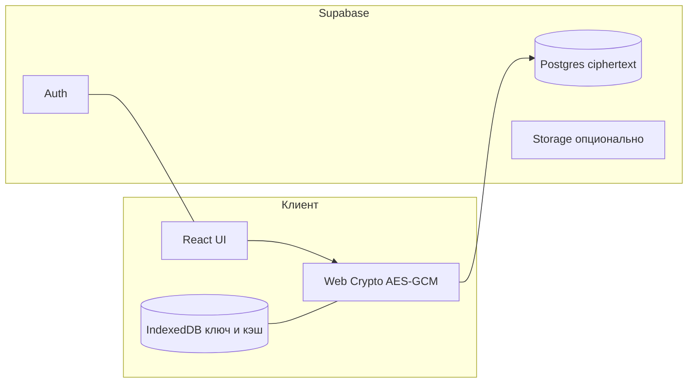
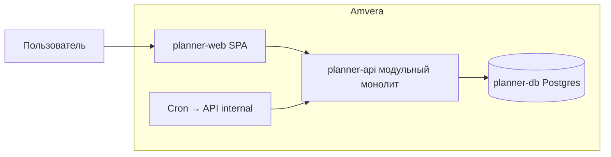
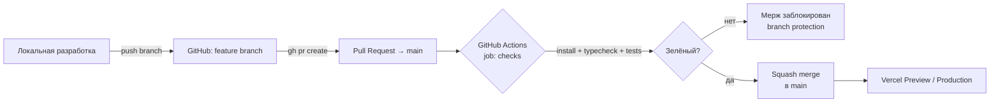

# Архитектура (высокий уровень)

## Поток данных

1. **Запись**: пользовательские сущности сериализуются → шифруются на клиенте → сохраняются как ciphertext.
2. **Чтение**: ciphertext загружается → расшифровка локально → отображение в UI.

## Offline-first

- Локальный источник истины для UX: **IndexedDB** (или аналог в выбранной offline-библиотеке) + очередь изменений.
- При появлении сети — **синхронизация** с сервером с разрешением конфликтов (стратегия — см. [[99-Открытые-вопросы-к-команде]]).

## Push-уведомления (PWA)

- **Web Push API** на клиенте.
- При необходимости доставки с сервера: **Supabase Edge Functions** или совместимый worker для подписок web push.

## Границы ответственности

| Слой | Ответственность |
|------|-----------------|
| Клиент | UX, шифрование, offline-кэш, анимации, отчёты по расшифрованным данным |
| Supabase | Идентичность, хранение blob-ов ciphertext, синхронизация через API |

Подробный каталог модулей: [[10-Каталог-функций-и-взаимодействий]].

## Миграция на Amvera (DR-019)

**Статус:** 🚧 В процессе (ветка `dev` только).  
**Решение:** [[12-Журнал-решений#DR-019 — Миграция Amvera: ветки, архитектура, уровни шифрования (2026-06-24)]]  
**Детальный план работ:** [[22-План-миграции-Amvera]]

### Целевая схема (после cutover)

| Проект Amvera | Содержимое |
|---------------|------------|
| `planner-web` | Сборка `web/dist`, PWA |
| `planner-api` | Модули: `auth`, `vault`, `notify`, `defects`, `admin`, `ai`; общение через `ports/` |
| `planner-db` | Схемы `auth`, `vault`, `notify`, `defects`, `admin` — отдельные DB-роли |
| `planner-jobs` | Минутный `send-due`, ежедневный cleanup *(опционально отдельный проект)* |

**Задел на split:** модуль выносится в отдельный проект Amvera при появлении `NOTIFY_SERVICE_URL` и аналогов; SQL **между** модулями запрещён.

### Legacy до cutover

| Контур | Ветка | Хостинг |
|--------|-------|---------|
| Прод | `main` | Vercel + Supabase |
| Переезд / stage | `dev` | Amvera (`*.amvera.io`) |

**В `main` не вливается** код миграции, пока не выполнен чеклист cutover (функциональный паритет, миграция данных, smoke, юридика при смене модели шифрования базового тарифа).

### Передача данных (платный E2E)

1. **Vault:** клиент → API только ciphertext + `version`; ключ на клиенте ([[DR-005]]).
2. **Гибрид metadata + сейф:** после расшифровки клиент отправляет строки расписания push (`task_id`, время; без названий в hybrid) — модуль `notify`.
3. **Зашифрованные команды (цель):** вместо полной перезаливки сейфа — зашифрованные операции; детали API — в backlog миграции.

### Уровни шифрования

| Тариф | Vault | Примечание |
|-------|-------|------------|
| **Базовый (free)** | Модель **пересматривается** | Не обязан совпадать с текущим E2E для всех |
| **Платный** | E2E vault, вкл/выкл пользователем | DR-005, контракт `VAULT_CRYPTO_CONTRACT` |

См. [[05-Freemium]], [[06-Приватность-и-безопасность]].

## CI / гейтинг PR

- Workflow: `.github/workflows/pr-checks.yml`, Node 22 LTS, ~36 секунд.
- Шаги: `npm install` → `npm run build -w web` (typecheck) → `npm test` (web + `@motivator/core`).
- `main` под branch protection: required check `checks`, force-push и удаление запрещены.

Подробности по всем инструментам, плагинам и скиллам проекта: [[18-CI-workflow-и-инструменты]]. Решение зафиксировано в [[12-Журнал-решений#DR-016 — CI: гейтинг PR через GitHub Actions]].
