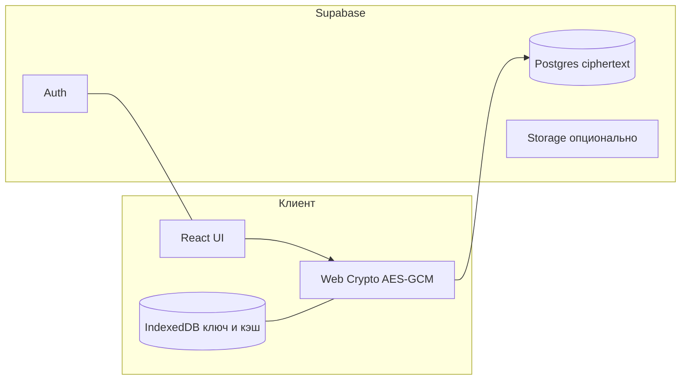

# Архитектура (высокий уровень)

## Поток данных

1. **Запись**: пользовательские сущности сериализуются → шифруются на клиенте → сохраняются как ciphertext.
2. **Чтение**: ciphertext загружается → расшифровка локально → отображение в UI.

## Offline-first

- Локальный источник истины для UX: **IndexedDB** (или аналог в выбранной offline-библиотеке) + очередь изменений.
- При появлении сети — **синхронизация** с сервером с разрешением конфликтов (стратегия — см. [[99-Открытые-вопросы-к-команде]]).

## Push-уведомления (PWA)

- **Web Push API** на клиенте.
- При необходимости доставки с сервера: **Supabase Edge Functions** или совместимый worker для подписок web push.

## Границы ответственности

| Слой | Ответственность |
|------|-----------------|
| Клиент | UX, шифрование, offline-кэш, анимации, отчёты по расшифрованным данным |
| Supabase | Идентичность, хранение blob-ов ciphertext, синхронизация через API |

Подробный каталог модулей: [[10-Каталог-функций-и-взаимодействий]].
