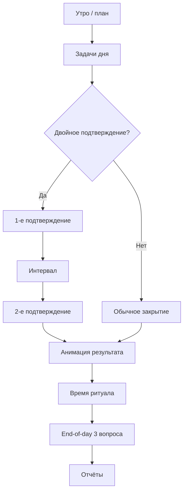

# User flow «одного дня»

Последовательность отражает целевой опыт после онбординга.

## 1. Первый запуск (однократно)

1. **Wizard**: выбор системы приоритетов (1–3 или Эйзенхауэр).
2. Согласие на **end-of-day** (глобально).
3. Выбор **времени ритуала**.

Связанные настройки позже доступны в профиле ([[10-Каталог-функций-и-взаимодействий#Настройки и wizard]]).

## 2. Планирование

Создание задач с:

- цветом, группой/проектом, приоритетом в выбранной системе;
- флагом **двойного подтверждения** и интервалом (default **+10 мин**);
- флагом участия в **end-of-day**.

## 3. Течение дня

1. **Push** (если настроено) → напоминание / первое подтверждение.
2. Пользователь отмечает **выполнил / не выполнил** (первый шаг двойного подтверждения, если включено).
3. Через выбранный интервал — **второй push** и **второе подтверждение** (если включено для задачи).

## 4. Конец дня

В заданное время — **end-of-day ритуал**:

- только задачи с флагом участия;
- **3 вопроса** из выбранного пользователем набора (база + 10 КПТ-шаблонов).

## 5. Рефлексия и метрики

Переход в **Отчёты**: диаграммы, стрик, таблица частых провалов ([[03-Scope-MVP-и-бэклог]]).

## Диаграмма потока

