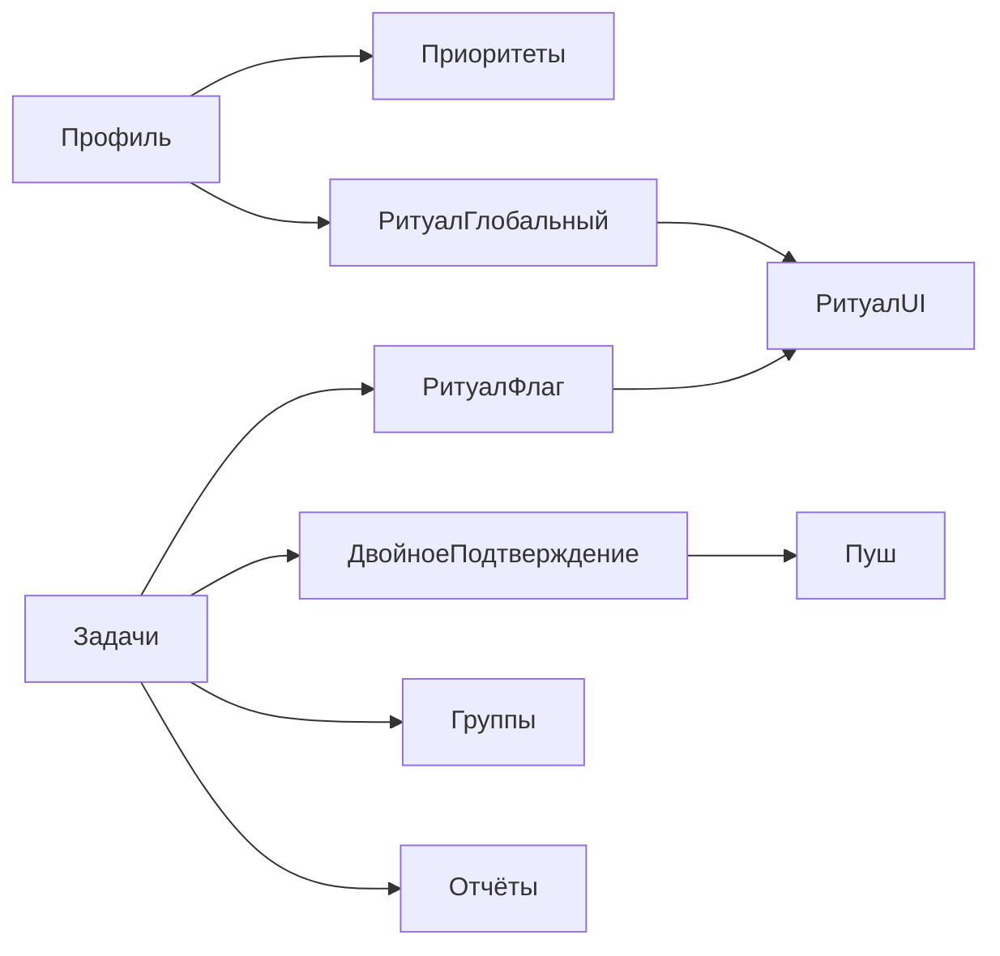

# Каталог функций и взаимодействий

Этот документ — **операционное описание продукта**: что есть в MVP, как модули связаны, какие данные пересекаются.

---

## Онбординг и настройки профиля

**Назначение:** быстро зафиксировать систему работы пользователя без перегруза.

| Элемент | Поведение |
|---------|-----------|
| Wizard первого запуска | Выбор системы приоритетов (см. ниже), согласие на end-of-day, время ритуала |
| Настройки профиля | Смена языка (структура i18n), системы приоритетов, глобальных флагов ритуала, уведомлений |
| Выход / смена устройства | Связано с [[06-Приватность-и-безопасность]] (ключ, QR) |

**Связи:** задачи наследуют систему приоритетов из профиля; ритуал использует глобальный флаг и время.

---

## Системы приоритетов

Два режима (выбор при первом запуске, смена в настройках):

1. **Уровни 1–3** — простая шкала (или три категории — уточнение в [[99-Открытые-вопросы-к-команде]] при необходимости UX).
2. **Матрица Эйзенхауэра** — ось срочности × важности (четыре квадранта).

**Взаимодействие:** каждая задача имеет поля приоритета в активной системе; отчёты могут группировать по приоритету в зависимости от выбранной визуализации.

---

## Задачи, подзадачи, декомпозиция

| Сущность | Описание |
|----------|----------|
| Задача | Основная единица планирования на день/период |
| Подзадача | Вложенная единица для декомпозиции; наследует или переопределяет контекст (цвет/группа — правила в [[11-Модель-данных-концептуально]]) |
| Декомпозиция целей | UX-поток разбиения крупной цели на подзадачи без отдельной «игровой» сущности |

**Взаимодействие:** выполнение подзадач может влиять на прогресс родителя (логика прогресса — зафиксировать в реализации).

---

## Организация: цвета, группы/проекты

- **Цвет** — визуальная метка (список, календарные представления если появятся).
- **Группа/проект** — логическая кластеризация для фильтров и **отчёта по группам**.

**Взаимодействие:** отчёт «по группам» агрегирует метрики выполнения по этому полю.

---

## Двойное подтверждение

**Назначение:** снизить импульсивные «галочки» и ложноположительные закрытия.

| Параметр | Поведение MVP |
|----------|----------------|
| Включение | По **каждой задаче** отдельно |
| Задержка по умолчанию | **10 минут** после первого подтверждения до второго запроса |
| Настраиваемая задержка | Пользователь задаёт интервал при создании/редактировании задачи |
| Канал напоминания | **PWA push** (настройки частоты и тихих часов — в продуктовых решениях) |

**Цепочка:** напоминание → первое действие (выполнил/нет) → таймер → второе подтверждение → запись в историю для отчётов и [[#Эмоциональные анимации|анимации]].

---

## End-of-day ритуал

**Назначение:** короткая КПТ-рефлексия по дню.

| Параметр | Поведение |
|----------|-----------|
| Глобальный выключатель | В настройках профиля |
| Участие задачи | Флаг на задаче |
| Вопросы за сессию | **3 вопроса** из выбранных пользователем шаблонов |
| Базовый контент | **10 КПТ-вопросов** как стартовый пул |
| Время запуска | Из wizard / настроек |

**Взаимодействие:** подтягиваются только задачи с флагом ритуала и фактом участия в дне (выполнялись/обсуждались — правило отбора см. [[99-Открытые-вопросы-к-команде]]).

---

## Эмоциональные анимации

**Назначение:** эмоциональная регуляция без морализаторства.

| Тип | MVP |
|-----|-----|
| Успех | Радость / подбадривание (**пара анимаций**) |
| Неуспех | Мягкая мотивация (**пара**) |
| Freemium | Выбор из **4** вариантов на бесплатном плане ([[05-Freemium]]) |

**Триггеры:** завершение подтверждения задачи, возможно закрытие ритуала (не дублировать перегрузом).

---

## Уведомления (PWA)

- Напоминания о задачах.
- Второй шаг двойного подтверждения.
- Напоминание о времени **end-of-day** (если включено).

**Взаимодействие:** настройки уведомлений ограничивают спам; офлайн-очередь синхронизируется при подключении ([[08-Архитектура]]).

---

## Отчёты

| Отчёт | Содержание MVP |
|-------|----------------|
| Процент выполнения | День / неделя / месяц |
| Столбчатые диаграммы | По дням; по дням недели за месяц; по группам |
| Стрик | Последовательность успешных дней (правило стрика — [[99-Открытые-вопросы-к-команде]]) |
| Часто проваленные задачи | Таблица по истории неуспехов |

**Входные данные:** только после локальной расшифровки; агрегации на клиенте или предрасчёт на сервере из ciphertext невозможен без изменения модели — см. [[08-Архитектура]] и вопросы по метаданным.

---

## Экспорт и аккаунт

- Экспорт **JSON** расшифрованных данных локально.
- Экспорт **ключа** (файл/base64).
- Удаление аккаунта и данных на сервере.

См. [[06-Приватность-и-безопасность]] и [[04-User-Stories]].

---

## Сводка зависимостей модулей

