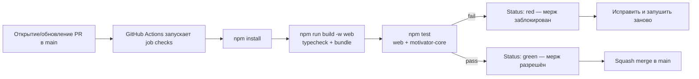

# Журнал решений (Decision Log)

> Зафиксированные продуктовые и технические решения для MVP **«Мотиватор»**. При конфликте с более старыми заметками **приоритет у этой заметки**; устаревшие формулировки в других файлах нужно привести в соответствие.

**Дата пакета решений:** 2026-05-09  
**Статус:** принято к реализации

---

## DR-001 — Стрик: что считается успешным днём

**Дата:** 2026-05-09  
**Связанные DR:** [[12-Журнал-решений#DR-013 — Стрик: уточнение под MVP v1.0 и DR-001]] (формализация «план на календарный день»), [[12-Журнал-решений#DR-002 — End-of-day: какие задачи попадают в ритуал]]

**Вопрос:** Какой календарный день засчитывается успешным для подсчёта стрика?

**Решение**

Календарный день считается **успешным для стрика**, если выполняются **оба** блока условий:

1. Пользователь **завершил ритуал End-of-Day** за этот календарный день: открыл сессию вечернего ритуала и довёл её до конца (в vault фиксируется [[eodCompletedLocalDates#Определение|eodCompletedLocalDates]]).
2. Выполняется **одно из**:
   - в **плане на этот день** ([[tasksPlannedForLocalDay#Определение|tasksPlannedForLocalDay]]) была хотя бы одна задача, и пользователь **отметил выполненной хотя бы одну** ([[taskCompletedOnLocalDay#Определение|taskCompletedOnLocalDay]]); **или**
   - в **плане на этот день не было ни одной задачи** — отсутствие выполненных **не** делает день неуспешным.

**Неуспешный день** (не входит в цепочку подряд идущих успешных дней) наступает, если:

- пользователь **не завершил** End-of-Day за календарный день; **или**
- в плане на день **были** задачи, но **ни одна** из них не отмечена выполненной (даже при завершённом EOD).

Пропуск отдельных задач при **непустом** плане **не** обнуляет стрик сам по себе: для успешного дня достаточно **одной** выполненной задачи из плана. Пустой план **не** наказывает за «ноль выполненных» — это отдельная ветка успеха при завершённом EOD.

Формальное определение «план на календарный день» и согласование с [[16-TZ-MVP-v1.0]] — в [[12-Журнал-решений#DR-013 — Стрик: уточнение под MVP v1.0 и DR-001]]. Алгоритм проверки — [[dr013DaySuccessful#Определение|dr013DaySuccessful]].

| Требование | Критерий | Источник (DR-xxx) |
|------------|----------|-------------------|
| Успешный день требует завершённого EOD | Для [[dateKey#Определение\|dateKey]] в [[eodCompletedLocalDates#Определение\|eodCompletedLocalDates]] есть эта дата | [[12-Журнал-решений#DR-001 — Стрик: что считается успешным днём]] |
| Пустой план не наказывает | Если [[tasksPlannedForLocalDay#Определение\|tasksPlannedForLocalDay]] на дату возвращает 0 задач, день успешен при завершённом EOD | [[12-Журнал-решений#DR-001 — Стрик: что считается успешным днём]] |
| Непустой план требует ≥1 выполненной | Если в плане ≥1 задача, день успешен только при ≥1 выполненной ([[taskCompletedOnLocalDay#Определение\|taskCompletedOnLocalDay]]) и завершённом EOD | [[12-Журнал-решений#DR-001 — Стрик: что считается успешным днём]] |
| Незавершённый EOD прерывает цепочку | День без завершённого EOD не входит в подсчёт подряд идущих успешных дней | [[12-Журнал-решений#DR-001 — Стрик: что считается успешным днём]] |

**Обоснование**

Целевая аудитория продукта (СДВГ, выгорание) нуждается в модели, которая **не наказывает** за день без запланированных задач. Продукт **приоритизирует** регулярность вечерней рефлексии (End-of-Day) и честное завершение ритуала над процентом закрытия всех задач плана.

**Влияние на MVP**

- Подсчёт стрика опирается на три факта за календарный день: завершён ли EOD ([[eodCompletedLocalDates#Определение|eodCompletedLocalDates]]), есть ли задачи в плане ([[tasksPlannedForLocalDay#Определение|tasksPlannedForLocalDay]]), сколько задач из плана отмечено выполненными ([[taskCompletedOnLocalDay#Определение|taskCompletedOnLocalDay]]).
- Проверка успешного дня в коде — [[dr013DaySuccessful#Определение|dr013DaySuccessful]] (`@motivator/core`).

---

## DR-002 — End-of-day: какие задачи попадают в ритуал

**Дата:** 2026-05-09  
**Связанные DR:** [[12-Журнал-решений#DR-001 — Стрик: что считается успешным днём]], [[12-Журнал-решений#DR-004 — Двойное подтверждение: пропуск второго шага]], [[12-Журнал-решений#DR-013 — Стрик: уточнение под MVP v1.0 и DR-001]]

**Вопрос:** Какие задачи показывать в ритуале End-of-Day, как их разделить и в каком порядке?

**Решение**

### Отбор задач для блоков «план на день»

В основные блоки ритуала (**«сделано»** и **«не закрыто»**) система включает задачи, у которых **одновременно** выполняются условия:

1. Поле [[includeInEodRitual#Определение|includeInEodRitual]] не равно `false` (по умолчанию задача **участвует** в ритуале; пользователь может снять флаг на карточке задачи).
2. Задача входит в **план на календарный день** ритуала — отбор [[tasksPlannedForEodRitual#Определение|tasksPlannedForEodRitual]] (план [[tasksPlannedForLocalDay#Определение|tasksPlannedForLocalDay]] + участие в ритуале), **то же правило**, что для вкладки «День» и стрика ([[12-Журнал-решений#DR-013 — Стрик: уточнение под MVP v1.0 и DR-001]]):
   - **разовая** задача: [[scheduledLocalDate#Определение|scheduledLocalDate]] совпадает с [[dateKey#Определение|dateKey]] ритуала;
   - **повторяющаяся** задача: на этот [[dateKey#Определение|dateKey]] по правилу повтора есть вхождение (серия не архивирована).

В эти блоки попадают **и выполненные, и невыполненные** задачи из плана.

**Бэклог** (незавершённые разовые задачи **без** [[scheduledLocalDate#Определение|scheduledLocalDate]] в плане) в блоки «сделано» / «не закрыто» **не входит**. Система показывает бэклог **отдельным мягким блоком-напоминанием**; он **не** участвует в прогрессе плана на день и **не** считается «провалом дня».

Эвристика «создана сегодня / изменена сегодня / дедлайн сегодня» **не применяется** — отбор привязан только к **плану на календарный день**.

### Порядок и подача в интерфейсе

1. Модалка ритуала показывает **кольцо прогресса** по [[plannedDayCompletionWeights#Определение|plannedDayCompletionWeights]] (каждая задача плана даёт до 1 в знаменателе; при чек-листе учитывается доля отмеченных пунктов).
2. Затем блок **«Сделано»** — задачи плана с главной отметкой выполнения за этот день ([[isMainTaskDoneForDay#Определение|isMainTaskDoneForDay]]); блок оформляется **радостной** анимацией и позитивным тоном заголовков и информеров.
3. Затем блок **«Не закрыто»** — задачи плана без главной отметки выполнения за этот день; при нуле незакрытых модалка подсвечивает блок как успех, иначе применяет **мягкую** анимацию и тон без морализаторства.
4. При наличии задач — блок **«Бэклог»** (напоминание, не санкция).
5. **КПТ-рефлексия:** после обхода списков пользователь получает **3 вопроса** из выбранного им набора шаблонов (стартовый пул — **10** вопросов; см. [[10-Каталог-функций-и-взаимодействий#End-of-day ритуал]]). Коррекция отметки «выполнено» после пропуска второго шага двойного подтверждения — по [[12-Журнал-решений#DR-004 — Двойное подтверждение: пропуск второго шага]] (через UI «День», не внутри модалки EOD).

Разделение списков — [[partitionEodTasksByCompletion#Определение|partitionEodTasksByCompletion]].

| Требование                          | Критерий                                                                                                                                                                                                                                                  | Источник (DR-xxx)                                                         |
| ----------------------------------- | --------------------------------------------------------------------------------------------------------------------------------------------------------------------------------------------------------------------------------------------------------- | ------------------------------------------------------------------------- |
| Задача участвует в ритуале          | У задачи [[includeInEodRitual#Определение\|includeInEodRitual]] `!== false` (по умолчанию — участие)                                                                                                                                                      | [[12-Журнал-решений#DR-002 — End-of-day: какие задачи попадают в ритуал]] |
| Задача в плане на день              | Разовая: [[scheduledLocalDate#Определение\|scheduledLocalDate]] `===` [[dateKey#Определение\|dateKey]]; повтор: вхождение по правилу повтора на [[dateKey#Определение\|dateKey]], серия не архивирована                                                   | [[12-Журнал-решений#DR-002 — End-of-day: какие задачи попадают в ритуал]] |
| Разделение «сделано» / «не закрыто» | «Сделано» — [[isMainTaskDoneForDay#Определение\|isMainTaskDoneForDay]](task, [[dateKey#Определение\|dateKey]]); «не закрыто» — задачи плана без этой отметки                                                                                              | [[12-Журнал-решений#DR-002 — End-of-day: какие задачи попадают в ритуал]] |
| Бэклог отдельно от плана            | Разовые задачи с [[scheduledLocalDate#Определение\|scheduledLocalDate]] `=== null`, не завершённые, с участием в ритуале — только в блоке напоминания                                                                                                     | [[12-Журнал-решений#DR-002 — End-of-day: какие задачи попадают в ритуал]] |
| Порядок блоков                      | Сначала «Сделано», затем «Не закрыто», затем «Бэклог» (если есть)                                                                                                                                                                                         | [[12-Журнал-решений#DR-002 — End-of-day: какие задачи попадают в ритуал]] |
| Прогресс плана                      | Кольцо показывает [[plannedDayCompletionWeights#^glossary-def-doneFraction\|doneFraction]] / [[plannedDayCompletionWeights#^glossary-def-plannedTaskCount\|plannedTaskCount]] из [[plannedDayCompletionWeights#Определение\|plannedDayCompletionWeights]] | [[12-Журнал-решений#DR-002 — End-of-day: какие задачи попадают в ритуал]] |

**Обоснование**

Привязка к **плану на календарный день** согласует ритуал с вкладкой «День» и стриком ([[12-Журнал-решений#DR-001 — Стрик: что считается успешным днём]], [[12-Журнал-решений#DR-013 — Стрик: уточнение под MVP v1.0 и DR-001]]), снижает шум от задач, которые пользователь не ставил на этот день. Порядок «сначала сделанное, затем незакрытое» задаёт эмоциональную траекторию: сначала закрепление успеха, затем мягкая рефлексия над остатком.

**Влияние на MVP**

- В модели задачи: [[includeInEodRitual#Определение|includeInEodRitual]], [[scheduledLocalDate#Определение|scheduledLocalDate]], правила повтора и отметки выполнения за день; в vault — [[eodCompletedLocalDates#Определение|eodCompletedLocalDates]] и настройки ритуала (глобальный вкл/выкл).
- UI модалки End-of-Day: кольцо прогресса, два блока плана с разной тональностью анимаций и текста, отдельный блок бэклога.
- Ядро ([[tasksPlannedForEodRitual#Определение|tasksPlannedForEodRitual]], [[partitionEodTasksByCompletion#Определение|partitionEodTasksByCompletion]]) и веб-модалка используют **одно** правило «план на день», без отбора по [[taskActiveOnLocalCalendarDay#Определение|taskActiveOnLocalCalendarDay]] (эвристика `createdAt` / `updatedAt`).

---

## DR-003 — Эйзенхауэр и Inbox

**Дата:** 2026-05-09  
**Связанные DR:** [[12-Журнал-решений#DR-012 — Стратегия MVP: календарь, планирование, приоритеты (MVP v1.0)]] (целевая модель приоритетов для MVP v1.0 **заменяет** это решение)

**Вопрос:** Обязательны ли четыре квадранта матрицы Эйзенхауэра, нужен ли Inbox и какой альтернативный режим предложить при онбординге?

**Решение**

> **Актуальность для MVP v1.0:** [[12-Журнал-решений#DR-012 — Стратегия MVP: календарь, планирование, приоритеты (MVP v1.0)]] принимает **единую настраиваемую шкалу приоритетов 1–5** (см. [[16-TZ-MVP-v1.0]]). Режимы «Эйзенхауэр + Inbox» и «уровни 1–3» из DR-003 относятся к **промежуточной модели** (ранний `web/`, vault schema **v3**); при миграции на v1.0 данные и UI переводятся на [[priorityRank#Определение|priorityRank]] 1–5. Текст ниже сохраняет **исходное решение** и правила миграции; возврат матрицы как опции — только отдельным DR.

### Режим «Эйзенхауэр + Inbox»

При выборе пользователем [[prioritySystem#Определение|prioritySystem]] со значением **`"eisenhower"`** каждая задача **обязательно** классифицирована **одним из** способов:

1. Поле [[eisenhowerQuadrant#Определение|eisenhowerQuadrant]] равно **`"q1"`**, **`"q2"`**, **`"q3"`** или **`"q4"`** — задача лежит в соответствующем квадранте матрицы (срочность × важность).
2. Поле [[eisenhowerQuadrant#Определение|eisenhowerQuadrant]] равно **`null`** — задача находится в **Inbox** (вне квадрантов, без назначенной позиции в матрице).

**Inbox** предназначен для **новых** задач до классификации: пользователь фиксирует задачу с минимальным трением и **позже** переносит её в квадрант (drag-and-drop или эквивалентное действие в UI).

### Альтернатива при онбординге

В wizard первого запуска (и в настройках профиля) пользователь может выбрать режим **`prioritySystem: "levels"`** — **уровни 1–3** вместо матрицы Эйзенхауэра. В этом режиме поле [[priorityLevel#Определение|priorityLevel]] задаёт приоритет задачи; [[eisenhowerQuadrant#Определение|eisenhowerQuadrant]] не используется.

### Миграция на MVP v1.0 ([[12-Журнал-решений#DR-012 — Стратегия MVP: календарь, планирование, приоритеты (MVP v1.0)]])

При переходе vault schema **v3 → v4** система преобразует приоритеты в [[priorityRank#Определение|priorityRank]] 1–5 ([[normalizeVault#Определение|normalizeVault]]):

| Исходное (v3) | [[priorityRank#Определение\|priorityRank]] (v4) |
|---------------|---------------------|
| Эйзенхауэр `q1` | 1 |
| Эйзенхауэр `q2` | 2 |
| Эйзенхауэр Inbox (`null`) | 3 |
| Эйзенхауэр `q3` | 4 |
| Эйзенхауэр `q4` | 5 |
| Уровни: [[priorityLevel#Определение\|priorityLevel]] 1 / 2 / 3 | 1 / 2 / 3 |

| Требование | Критерий | Источник (DR-xxx) |
|------------|----------|-------------------|
| Классификация в режиме Эйзенхауэра | У каждой задачи [[eisenhowerQuadrant#Определение\|eisenhowerQuadrant]] `∈ {q1,q2,q3,q4}` **или** `null` (Inbox) | [[12-Журнал-решений#DR-003 — Эйзенхауэр и Inbox]] |
| Семантика Inbox | [[eisenhowerQuadrant#Определение\|eisenhowerQuadrant]] `=== null` при [[prioritySystem#Определение\|prioritySystem]] `"eisenhower"` — задача в Inbox, не ошибка данных | [[12-Журнал-решений#DR-003 — Эйзенхауэр и Inbox]] |
| Перенос из Inbox | Пользователь может назначить квадрант задаче из Inbox через DnD или эквивалент; после переноса [[eisenhowerQuadrant#Определение\|eisenhowerQuadrant]] не `null` | [[12-Журнал-решений#DR-003 — Эйзенхауэр и Inbox]] |
| Альтернативный режим | При [[prioritySystem#Определение\|prioritySystem]] `"levels"` приоритет задаёт [[priorityLevel#Определение\|priorityLevel]] (1–3); матрица не отображается | [[12-Журнал-решений#DR-003 — Эйзенхауэр и Inbox]] |
| Выбор режима | Wizard или настройки профиля сохраняют [[prioritySystem#Определение\|prioritySystem]] на уровне vault | [[12-Журнал-решений#DR-003 — Эйзенхауэр и Inbox]] |

**Обоснование**

Матрица Эйзенхауэра задаёт структуру «срочность × важность»; Inbox снижает порог входа при быстром захвате задачи без немедленной классификации. Режим «уровни 1–3» даёт пользователю, которому не нужна четырёхквадрантная модель, альтернативу без противоречия wizard выбора системы.

**Влияние на MVP**

- **Промежуточная модель (v0.x / schema v3):** [[priorityLevel#Определение|priorityLevel]], [[eisenhowerQuadrant#Определение|eisenhowerQuadrant]]; настройка vault [[prioritySystem#Определение|prioritySystem]]; UI — Inbox и сетка квадрантов или секции по уровням 1–3.
- **Целевая модель MVP v1.0 ([[12-Журнал-решений#DR-012 — Стратегия MVP: календарь, планирование, приоритеты (MVP v1.0)]]):** одно поле [[priorityRank#Определение|priorityRank]] (1–5) и настраиваемые названия уровней; миграция v3→v4 в [[normalizeVault#Определение|normalizeVault]] (`@motivator/core`).
- Открытый вопрос «уровни 1–3 vs 1–5» для финального продукта закрыт решением [[12-Журнал-решений#DR-012 — Стратегия MVP: календарь, планирование, приоритеты (MVP v1.0)]] в пользу **1–5**.

---

## DR-004 — Двойное подтверждение: пропуск второго шага

**Дата:** 2026-05-09  
**Связанные DR:** [[12-Журнал-решений#DR-002 — End-of-day: какие задачи попадают в ритуал]], [[09-User-Flow-одного-дня]]

**Вопрос:** Что делает система, если пользователь не завершил второй шаг двойного подтверждения «сделано»?

**Решение**

### Область действия

- Двойное подтверждение **включается по задаче** ([[doubleConfirmEnabled#Определение|doubleConfirmEnabled]] `=== true`); по умолчанию **выключено**.
- Механика применяется только при отметке выполнения за **календарный «сегодня»** ([[dateKey#Определение|dateKey]] устройства); для прошлых и будущих дней правила не активируются.

### Два шага, интервал и окно подтверждения

1. **Первый шаг:** пользователь нажимает главную галочку «выполнено» — система **не** записывает выполнение сразу, а создаёт [[doubleConfirmPending#Определение|doubleConfirmPending]] для этого локального дня с полями [[doubleConfirmPending#^glossary-def-localDate|localDate]], [[doubleConfirmPending#^glossary-def-firstStepAtIso|firstStepAtIso]], [[doubleConfirmPending#^glossary-def-confirmDeadlineIso|confirmDeadlineIso]].
2. **Пауза до второго напоминания:** [[doubleConfirmIntervalMinutes#Определение|doubleConfirmIntervalMinutes]] (на задаче; default **10** мин) — время от первого шага до момента **второго push / второго запроса** подтверждения (см. [[09-User-Flow-одного-дня]], [[10-Каталог-функций-и-взаимодействий#Двойное подтверждение]]).
3. **Окно подтверждения после второго напоминания:** [[doubleConfirmGraceMinutes#Определение|doubleConfirmGraceMinutes]] (default **30** мин) — сколько минут **после** второго напоминания пользователь ещё может нажать галочку повторно.
4. **Второй шаг:** повторное нажатие галочки **до** конца окна ([[doubleConfirmPending#^glossary-def-confirmDeadlineIso|confirmDeadlineIso]] в [[doubleConfirmPending#Определение|doubleConfirmPending]]) — система записывает выполнение за день и **снимает** pending ([[applyToggleTask#Определение|applyToggleTask]]).
5. **Конец окна:** [[doubleConfirmPending#^glossary-def-confirmDeadlineIso|confirmDeadlineIso]] = [[doubleConfirmPending#^glossary-def-firstStepAtIso|firstStepAtIso]] + [[effectiveDoubleConfirmIntervalMin#Определение|effectiveDoubleConfirmIntervalMin]](task) + [[effectiveDoubleConfirmGraceMin#Определение|effectiveDoubleConfirmGraceMin]](task) (на задаче 1–1440 мин каждый; расчёт — [[computeDoubleConfirmDeadlineIso#Определение|computeDoubleConfirmDeadlineIso]]).

Пользователь может **отменить** ожидание второго шага (снять [[doubleConfirmPending#Определение|doubleConfirmPending]]) без записи выполнения — через UI мини-карточки или редактора задачи.

### Push-напоминание о втором шаге

**Когда:** push «Не забыли подтвердить задачу?» (или эквивалент) отправляется в момент **второго напоминания** — через [[effectiveDoubleConfirmIntervalMin#Определение|effectiveDoubleConfirmIntervalMin]](task) после [[doubleConfirmPending#^glossary-def-firstStepAtIso|firstStepAtIso]] в [[doubleConfirmPending#Определение|doubleConfirmPending]] (интервал задаёт [[doubleConfirmIntervalMinutes#Определение|doubleConfirmIntervalMinutes]] на задаче; не фиксированные 10 мин «после дедлайна»).

**Не путать с исходной опечаткой DR-004:** формулировка «10 минут **после дедлайна**» неверна; **10** — default [[doubleConfirmIntervalMinutes#Определение|doubleConfirmIntervalMinutes]]; **30** — default [[doubleConfirmGraceMinutes#Определение|doubleConfirmGraceMinutes]] **после** второго напоминания.

**Реализация:** поля и таймеры на клиенте есть (vault **v7+**, UI, [[applyExpireStaleDoubleConfirm#Определение|applyExpireStaleDoubleConfirm]]); **планирование push** для активного [[doubleConfirmPending#Определение|doubleConfirmPending]] в [[computeScheduledFireRequests#Определение|computeScheduledFireRequests]] **ещё не добавлено** — сейчас только типы `task_start`, `task_end`, `eod_reminder` (см. страницу метода). Доставка второго push — доработка в scope уведомлений (см. [[13-Черновики-решений#DR-014 (черновик) — Push-уведомления (PWA)]]).

### Пропуск второго шага (истечение окна)

Если момент **позже** [[doubleConfirmPending#^glossary-def-confirmDeadlineIso|confirmDeadlineIso]] ([[doubleConfirmPending#Определение|doubleConfirmPending]]) наступил, а второй шаг **не** выполнен:

- система **снимает** [[doubleConfirmPending#Определение|doubleConfirmPending]] ([[applyExpireStaleDoubleConfirm#Определение|applyExpireStaleDoubleConfirm]] на клиенте, периодический проход);
- выполнение за этот день **не записывается** — задача остаётся **невыполненной**;
- отдельного статуса **`Failed`** в модели задачи **нет** (продуктово: «не засчитано», а не «провал» как отдельное поле).

> **Уточнение к исходной формулировке:** ранний текст DR-004 говорил об авто-**Failed**; в реализации MVP v1.0 (vault schema **v7+**, `@motivator/core`) — только **сброс ожидания без отметки «сделано»**. Для отчётов и EOD задача попадает в «не закрыто», если выполнение не было зафиксировано.

### Коррекция после истечения окна

Пользователь может **в любой момент** (в том числе вечером при обзоре дня) **вручную** отметить задачу выполненной или снять отметку через UI вкладки «День» / карточки задачи. Модалка End-of-Day в MVP — **обзор** состояния плана; редактирование галочки выполняется **вне** модалки. Это сохраняет контроль пользователя над данными после ошибочного или пропущенного второго шага.

| Требование | Критерий | Источник (DR-xxx) |
|------------|----------|-------------------|
| Opt-in на задаче | [[doubleConfirmEnabled#Определение\|doubleConfirmEnabled]] `=== true`; иначе один клик сразу записывает выполнение | [[12-Журнал-решений#DR-004 — Двойное подтверждение: пропуск второго шага]] |
| Первый шаг | После первого клика по галочке за «сегодня» появляется [[doubleConfirmPending#Определение\|doubleConfirmPending]] с [[doubleConfirmPending#^glossary-def-localDate\|localDate]], [[doubleConfirmPending#^glossary-def-firstStepAtIso\|firstStepAtIso]], [[doubleConfirmPending#^glossary-def-confirmDeadlineIso\|confirmDeadlineIso]] | [[12-Журнал-решений#DR-004 — Двойное подтверждение: пропуск второго шага]] |
| Дедлайн окна | [[doubleConfirmPending#^glossary-def-confirmDeadlineIso\|confirmDeadlineIso]] = [[doubleConfirmPending#^glossary-def-firstStepAtIso\|firstStepAtIso]] + interval + grace ([[computeDoubleConfirmDeadlineIso#Определение\|computeDoubleConfirmDeadlineIso]]) | [[12-Журнал-решений#DR-004 — Двойное подтверждение: пропуск второго шага]] |
| Второй push (целевой) | `fire_at` = [[doubleConfirmPending#^glossary-def-firstStepAtIso\|firstStepAtIso]] + [[effectiveDoubleConfirmIntervalMin#Определение\|effectiveDoubleConfirmIntervalMin]](task); при активном pending и включённых push | [[12-Журнал-решений#DR-004 — Двойное подтверждение: пропуск второго шага]] |
| Второй шаг в срок | Повторный клик до [[doubleConfirmPending#^glossary-def-confirmDeadlineIso\|confirmDeadlineIso]] → выполнение записано, pending снят ([[applyToggleTask#Определение\|applyToggleTask]]) | [[12-Журнал-решений#DR-004 — Двойное подтверждение: пропуск второго шага]] |
| Истечение без второго шага | После [[doubleConfirmPending#^glossary-def-confirmDeadlineIso\|confirmDeadlineIso]] — [[applyExpireStaleDoubleConfirm#Определение\|applyExpireStaleDoubleConfirm]]; выполнение **не** записано | [[12-Журнал-решений#DR-004 — Двойное подтверждение: пропуск второго шага]] |
| Отмена ожидания | Пользователь может сбросить [[doubleConfirmPending#Определение\|doubleConfirmPending]] без записи выполнения | [[12-Журнал-решений#DR-004 — Двойное подтверждение: пропуск второго шага]] |

**Обоснование**

Автоматический сброс «зависшего» ожидания снимает подвисшие состояния в UI и данных. Отсутствие отдельного статуса «Failed» и возможность ручной коррекции снижают тревогу за ошибочный провал и поддерживают честность учёта без жёсткого наказания в модели задачи.

**Влияние на MVP**

- Поля задачи (vault **v7+**): [[doubleConfirmEnabled#Определение|doubleConfirmEnabled]], [[doubleConfirmIntervalMinutes#Определение|doubleConfirmIntervalMinutes]], [[doubleConfirmGraceMinutes#Определение|doubleConfirmGraceMinutes]], [[doubleConfirmPending#Определение|doubleConfirmPending]].
- Ядро: [[applyToggleTask#Определение|applyToggleTask]], [[applyExpireStaleDoubleConfirm#Определение|applyExpireStaleDoubleConfirm]], [[computeDoubleConfirmDeadlineIso#Определение|computeDoubleConfirmDeadlineIso]] (`@motivator/core`); defaults 10 / 30 мин.
- UI: чекбокс в «Дополнительные настройки»; индикатор ожидания и отмена на мини-карточке; периодический сброс просрочки через [[applyExpireStaleDoubleConfirm#Определение|applyExpireStaleDoubleConfirm]] на клиенте.
- Push по второму шагу: `fire_at` = [[doubleConfirmPending#^glossary-def-firstStepAtIso|firstStepAtIso]] + [[effectiveDoubleConfirmIntervalMin#Определение|effectiveDoubleConfirmIntervalMin]](task); планирование в [[computeScheduledFireRequests#Определение|computeScheduledFireRequests]] — **TODO**; см. раздел «Push-напоминание о втором шаге».

---

## DR-005 — Ключ шифрования: экспорт, QR, восстановление на устройстве

**Вопрос:** Как совместить безопасность и перенос между устройствами?

**Решение (оптимальный вариант)**

- Один **мастер-ключ** для **AES-GCM**.
- При генерации сохраняется **seed** (криптостойкая случайная строка **32 байта**).
- Ключ выводится как **PBKDF2(seed + опциональный пароль пользователя)**; режим **без пароля** допустим, если пользователь так выбрал.
- **Экспорт** для пользователя — **base64 от seed** (не от готового ключа).
- **QR-код** содержит тот же **base64-seed** (или URI-обёртку — уточняется на реализации при сохранении совместимости сканеров).
- На новом устройстве: сканирование QR → seed → повторная деривация ключа → расшифровка данных после авторизации.

**Про Auth и QR**

- **Supabase Auth** остаётся отдельным потоком входа в аккаунт.
- QR переносит **только материал для восстановления ключа**; сессия приложения не «перепрыгивает» через QR без прохождения аутентификации.

**Обоснование**

Seed экспортируемый, ключ деривации гибкий; перенос удобный; сервер по-прежнему не обязан знать ключ.

**Влияние на MVP**

- Реализация PBKDF2 + хранение seed в IndexedDB + экран экспорта/импорта/QR.
- Копирайт про то, что экспортируется **seed**, не «ключ» в пользовательских терминах — опционально упростить формулировки в UI.

---

## DR-006 — Потеря ключа: тексты и сценарии

**Вопрос:** Какие предупреждения и сценарии при потере ключа?

**Решение**

- При **первом экспорте** и в **настройках** — жёсткое предупреждение:  
  *«Если вы потеряете этот ключ — все ваши задачи и рефлексии будут навсегда недоступны. Мы не храним ключ на сервере. Это осознанный выбор максимальной приватности.»*
- При попытке входа **без возможности расшифровки** — заметное предупреждение (высокая заметность) + кнопка **«Я потерял ключ → удалить все данные и начать заново»**.

**Обоснование**

Согласованность с моделью клиентского шифрования и юридически значимое информирование.

**Влияние на MVP**

- Юридические тексты согласовать с офертой/политикой ([[DR-009]]).
- Поток сброса с подтверждением удаления на сервере.

---

## DR-007 — Отчёты: где считать аналитику

**Вопрос:** Нужны ли нешифрованные агрегаты на сервере?

**Решение**

Для MVP — **строго на клиенте**. Сервер хранит **только зашифрованные** пользовательские данные.

Все диаграммы, проценты, «часто проваленные» и прочая аналитика — **после локальной расшифровки**.

**Обоснование**

Проще **RLS и модель угроз**, соответствие обещанию приватности, единая философия продукта.

**Влияние на MVP**

- Производительность на слабых устройствах — учитывать при объёме данных (батчи, Web Worker при необходимости — отдельная техническая задача).

---

## DR-008 — «Часто проваленные задачи»: группировка

**Вопрос:** Как агрегировать в таблице провалов?

**Решение**

- Для **повторяющихся** задач — группировать по **шаблону повторения** (одна строка на шаблон).
- Для **разовых** — показывать **топ-5** по числу провалов за **последние 30 дней**.

**Обоснование**

Повторяющиеся дают осмысленный паттерн; разовые не засоряют список бесконечными дубликатами названий.

**Влияние на MVP**

- Идентификатор шаблона/серии в модели повторов ([[11-Модель-данных-концептуально]]).

---

## DR-009 — Юридическое оформление (MVP)

**Вопрос:** Юрисдикция, документы, сроки.

**Решение**

- **Юрисдикция:** Россия.
- **Владелец на старте:** ИП или ООО; допускается оформление от **физлица** на самом раннем этапе с последующим переносом (зафиксировать фактического правообладателя в документах на момент публикации).
- До **первого публичного запуска** подготовить:
  - публичную **оферту**;
  - **политику конфиденциальности** (с явным упоминанием **клиентского шифрования**);
  - **согласие на обработку персональных данных**.
- **Срок:** за **1–2 недели до релиза**.

**Обоснование**

Минимально достаточный комплект для легального запуска в РФ и прозрачности модели данных.

**Влияние на MVP**

- Блокер для публичного продакшена без документов; не блокирует внутреннюю разработку.

---

## DR-010 — Цена премиума

**Вопрос:** Выбор цены в диапазоне 299–499 ₽ и эксперименты.

**Решение**

- Базовая цена: **349 ₽/мес** **или** **3490 ₽/год** со скидкой **15–20%** от месячной суммы.
- После **100 платящих пользователей** — **A/B-тест**: **299 vs 349 vs 399** (метрики конверсии и LTV уточнить при запуске эксперимента).

**Обоснование**

«Золотая середина» для ЦА 18–35; не якорится к нижней и верхней границе диапазона без данных.

**Влияние на MVP**

- В биллинге заложить возможность смены прайс-листа и экспериментов; конкретный платёжный провайдер — отдельное решение.

---

## DR-011 — Инфраструктура и масштабирование

**Вопрос:** Подтверждение стека и когда уходить с managed/hosted конфигурации.

**Решение**

- **MVP и первые 6–12 месяцев:** **Vercel** (frontend) + **Supabase** (backend) — окончательное **«да»**.
- Бесплатных/стартовых лимитов Supabase ожидаемо хватает примерно до **5–10 тыс. активных пользователей** (ориентир, не SLA провайдера).
- Переход на **self-host** или выделенный сервер рассматривать при:
  - **~10k MAU** **или**
  - появлении требований уровня **enterprise** по ПДн/GDPR/регуляторике.

**Обоснование**

Скорость запуска, предсказуемость для малой команды; переносимость при сохранении клиентского шифрования.

**Влияние на MVP**

- Архитектурные решения не должны блокировать будущий self-host Postgres ([[08-Архитектура]]).

---

## DR-012 — Стратегия MVP: календарь, планирование, приоритеты (MVP v1.0)

**Статус:** Approved  
**Дата:** 2026-05-09  

**Вопрос:** Какую траекторию MVP принимаем для связки «планирование — календарь — отчёты» и какие сущности обязательны?

**Решение**

- Принят **Вариант А** из продуктовых обсуждений: **полноценное планирование по датам**, **визуальный календарь** (день / неделя с таймблокингом / месяц), **нормальные отчёты** на клиенте ([[DR-007]]).
- Обязательный объём MVP по сущностям и экранам — **единый источник правды:** заметка [[16-TZ-MVP-v1.0]] (**продукт v1.0.0**, редакция документа ТЗ **1.6**).
- **Приоритеты:** настраиваемая шкала **1–5 с названиями**; это **целевая модель MVP** для новой реализации.
- **Режим Эйзенхауэр + Inbox** из [[DR-003]] и промежуточная реализация в коде (`web/`, уровни 1–3 / матрица) **не входят в финальную модель MVP v1.0**; при разработке по TZ предполагается **миграция** пользовательских данных и UI на календарь + шкалу 1–5. Отдельное решение нужно, только если продукт позже вернёт матрицу как опцию.

**Обоснование**

Зафиксированное ТЗ устраняет неопределённость между отчётами и планированием; разработчик опирается на один документ.

**Влияние на MVP**

- Обновлены [[03-Scope-MVP-и-бэклог]], закрыт тематический блок в [[99-Открытые-вопросы-к-команде]].
- План внедрения по этапам: [[17-План-реализации-MVP]].

---

## DR-013 — Стрик: уточнение под MVP v1.0 и DR-001

**Статус:** Approved  
**Дата:** 2026-05-09  

**Вопрос:** В [[16-TZ-MVP-v1.0]] стрик сформулирован как прохождение End-of-Day и **≥1 выполненная задача из плана дня**. В [[DR-001]] было правило: если **запланированных задач на день не было**, стрик **не ломается** из-за отсутствия выполненных. Как совместить?

**Решение**

**Успешный календарный день для целей стрика** (надстройка над формулировками ТЗ и DR-001):

1. Пользователь **прошёл End-of-Day** за этот день (ритуал завершён).
2. И выполняется **одно из**:
   - в **плане на этот день** были задачи и выполнена **хотя бы одна** из них; **или**
   - в **плане на этот день не было ни одной задачи** — стрик **не ломается** из-за «ноль выполненных» (как в DR-001).

**Стрик «ломается»** по правилам [[DR-001]], если пользователь **не прошёл EOD** в ожидаемом сценарии — без изменения этой логики.

**Обоснование**

Сохраняем психологическую модель DR-001 (не наказывать за пустой план) и согласуем с ТЗ, где акцент на «задачи из плана» для типичного дня.

**Влияние на MVP**

- Реализация подсчёта стрика должна опираться на факты: «есть ли задачи в плане на дату», «сколько выполнено», «факт EOD за дату».

---

## DR-014 — Онбординг seed: два экрана и восстановление ключа (фаза 7)

**Статус:** Approved  
**Дата:** 2026-05-15  

**Вопрос:** Как разделить онбординг для нового пользователя и возврата без локального seed? Что считать «восстановлением seed» в MVP?

**Решение**

Три слоя (не путать):

| Слой | Назначение |
|------|------------|
| **Пароль входа** (Supabase email/password) | Сессия аккаунта; смена в `/settings` → «Аккаунт». **Не** расшифровывает vault. |
| **Seed (base64)** + **пароль KDF** (PBKDF2, может быть пустым) | Клиентское шифрование vault; хранятся в браузере; без пары seed+KDF серверный ciphertext не прочитать. |

**Ветвление после успешного `/login`:**

1. **Seed+KDF уже в этом браузере** (`unlocked`) → **сразу `/app`**, онбординг не показывать.
2. **На сервере у `user_id` уже есть зашифрованный vault** (факт строки ciphertext, без расшифровки) → экран **«Восстановление ключа»**:
   - только **вставка seed (base64)** + **пароль KDF**;
   - **без** генерации нового seed в основном потоке;
   - тексты DR-006: нужна **сохранённая** копия seed; поддержка не восстанавливает содержимое.
3. **Vault на сервере отсутствует** (первичная настройка) → экран **«Первичная настройка шифрования»**:
   - только **генерация** seed + обязательное подтверждение сохранения (DR-006) **до** перехода в `/app`;
   - импорт seed — вторично (редкий перенос), не равноправная вкладка по умолчанию.

**Восстановление seed в продукте (MVP)** — это **не** восстановление командой и **не** автоматический сброс на сервере:

- Пользователь **сам** вводит сохранённый **seed + KDF** (онбординг «Восстановление ключа» или отдельный wizard при `decryptFailed` — см. ниже).
- **Резервная копия:** экспорт в `/settings` (копия, файл, QR) — [[DR-005]], предупреждения [[DR-006]].
- **После выхода:** `lock()` удаляет seed из браузера → снова вход → экран восстановления (п. 2), не генерация по умолчанию.
- **При `decryptFailed`:** баннер + CTA **«Восстановить доступ к данным»** — wizard ввода seed+KDF **на `/app` / в settings без выхода** (вариант **A**, PO); серверный blob при ошибке расшифровки **не** перезаписывается пустым vault.

**Полная ротация seed и/или KDF (в scope фазы 7, после 7a.1)**

Допускается **полная** смена ключевого материала для **уже существующего** vault (не только «забыли и импортируем старый»):

| Вариант | Что меняется | Поведение |
|---------|--------------|-----------|
| **Полная ротация** | Новый **seed** (и при необходимости новый **пароль KDF**) | Расшифровать vault **текущей** парой → сгенерировать новую пару → **перешифровать** весь JSON локально → **заменить** ciphertext на сервере (новая версия). Старый seed **не** открывает новый blob. |
| **Смена только KDF** (тот же seed) | Только пароль KDF | Тот же seed base64 → новый KDF → re-derive → перешифровка и upload. Подмножество полной ротации. |

**Условия (обязательные):**

- Доступен только при **успешной** расшифровке текущего vault (`!decryptFailed`, `remoteHydrated`).
- Перед завершением — **DR-006** для **новой** пары: экспорт/копия нового seed + подтверждение сохранения.
- Явное предупреждение: **старая** резервная копия seed/KDF **не** открывает актуальный vault; на сервере **заменяем** ciphertext **без** хранения предыдущей версии (PO). Перед завершением ротации — **обязательная выгрузка/копия нового seed** (DR-006).
- Точка входа в `/settings`: **отдельно** «Сменить только пароль KDF» и «Новый seed» (полная ротация) — **не** путать с онбордингом возврата.
- **Upload нового ciphertext:** до успеха — **блокировка** UI с явным «ожидание сохранения на сервер»; при длительной неудаче — **откат** к старой паре seed/KDF в браузере с уведомлением и **подтверждением наличия старого seed** у пользователя. При **выходе** во время ожидания — сброс состояния ожидания + в сценарий выхода добавить подтверждение **наличия старого seed** (помимо обычного предупреждения об удалении ключа из браузера).
- Блокировка при несохранённых правках vault (`savePending`) до старта ротации.

**Не путать с:**

- **Восстановлением** (импорт **старого** seed после выхода / нового устройства) — без смены ключа на сервере.
- **Онбордингом «новый seed»** при существующем vault без перешифровки — **запрещён** (см. ветвление выше).

**Импорт seed: вставка и QR (PO)**

- **Вставка** base64 в поле — **всегда** основной способ (онбординг, recovery).
- **QR** на импорте — **не другой секрет**: в QR закодирована **та же строка seed**, что при экспорте; камера **подставляет** её в поле вставки (удобно перенести с телефона/распечатки без ручного ввода). Симметрия с экспортом QR в `/settings`.

**Вне основного текста DR (фаза 7, другие решения PO):**

- **Удаление аккаунта (7b):** вариант **A** — после запроса удаления **30 календарных дней**, в течение которых восстановление аккаунта/доступа к ciphertext по **тому же seed** (детали сервера — в спецификации 7b); затем **полное** уничтожение. Восстановление по ключу = **seed**, не отдельный токен. Перед удалением — **подтверждения в UI достаточно** (обязательный экспорт seed **не** требуем); отдельное подтверждение паролем/email для удаления — **нет**.
- **«Потерял ключ → удалить данные и начать заново»** ([[DR-006]]) — **заложить** в фазу 7 (согласовать границу с 7b в реализации).
- **Экспорт JSON** расшифрованного vault — в фазе 7 как **тестовая выгрузка**; **seed** (онбординг, экспорт, ротация) — полноценная реализация по приоритету.
- **Юридика:** финальные тексты на **страницах** `/legal/*` в приложении; правообладатель на момент черновиков — **ООО «Тест»** ([[DR-009]] уточнить к релизу).
- **Cookie:** сейчас только necessary; **аналитика** — заложить позже (категории/opt-in).
- **Регистрация:** чекбокс **согласия на обработку ПДн** (отдельно от cookie-баннера).
- **Feedback:** все варианты каналов как **заглушки** в UI; точка входа — **только `/settings`**; без входа — **нет**.
- **«Забыл пароль»** (Supabase reset) — **да**, фаза 7; неподтверждённый email при регистрации — **как сейчас**, **пересмотреть после MVP**.
- **Permissions** и ограничения UI по ролям (в т.ч. дорожная карта) — **в scope фазы 7** (не откладывать отдельно «после»).
- **Закрытие фазы 7** в roadmap — когда готовы **все** срезы вместе: 7a + 7a.1 + 7c + 7b + перечисленное выше.

**Обоснование**

Текущий единый `/onboarding` с вкладкой «Новый seed» по умолчанию допускает потерю доступа у возвращающегося пользователя (новый seed при существующем ciphertext). Ветка по **наличию vault на сервере**, а не по локальному seed (после выхода локально seed пуст у всех).

**Влияние на MVP**

- Реализация: **7a.1** — детекция vault после login, два маршрута UI, recovery wizard; **7c** (или хвост 7a.1) — **полная ротация** seed/KDF в `/settings`; см. [[17-План-реализации-MVP#Фаза 7]].
- Документация: `web/README.md` (раздел «Seed и повторный вход»), `productRoadmap.ts` (фаза 7).
- **7a (0.7.0)** — экспорт seed и юридика **без** этого ветвления; статус «частично».

**Критерии приёмки (кратко)**

1. После login, если vault на сервере есть — UI **не** предлагает генерацию seed без отдельного опасного подтверждения.
2. Первый пользователь без vault — генерация + ack DR-006 до `/app`.
3. При `decryptFailed` — путь ввода **верного** seed+KDF с успешным decrypt и `canEdit`.
4. Пароль входа и seed/KDF в копирайте **разведены**.
5. Экспорт seed в settings остаётся; импорт/замена ключа в settings или recovery — в scope 7a.1.
6. **Полная ротация:** при успешном decrypt — отдельные действия KDF / новый seed; замена ciphertext; обязательная выгрузка нового seed; блокировка до upload; откат с подтверждением старого seed при сбое.
7. **Выход:** предупреждение об удалении seed из браузера; при незавершённой ротации — сброс ожидания + подтверждение наличия старого seed.
8. **Первичная настройка:** ack «сохранил seed» до `/app`.
9. **decryptFailed:** recovery wizard **без** обязательного sign out.
10. **Удаление аккаунта (7b):** 30 дней + восстановление по seed, затем полное удаление.
11. **JSON export:** тестовая выгрузка в фазе 7.
12. **Регистрация:** чекбокс ПДн; **forgot password**; legal in-app; feedback stubs в settings.

---

## DR-015 — Админ-панель: подтверждение смены роли через модалку

**Контекст:** смена роли пользователя требовала `window.confirm` (дважды при self-demote). Браузерный alert блокирует UI-поток и не стилизуется.

**Решение:** `ConfirmRoleModal` внутри `AdminMotivatorRolePanel` — email + стрелка `[старая роль] → [новая роль]` с цветными бейджами, предупреждение при self-demote, кнопка становится «Загрузка…» во время запроса.

**Отклонено:** inline-подтверждение в ячейке таблицы (неудобно в узкой колонке).

**Последствия:** одна модалка заменяет два `window.confirm`, включая двойной self-demote guard.

---

## DR-016 — CI: гейтинг PR через GitHub Actions

**Дата:** 2026-05-31
**Статус:** принято к реализации

**Вопрос:** Гонять ли автотесты перед каждым мерджем PR в `main`, и какие именно проверки делать блокирующими?

**Решение**

- Создан workflow `.github/workflows/pr-checks.yml` (job `checks`).
- Триггер: `pull_request` в `main` и `push` в `main`.
- Шаги: `npm install` → `npm run build -w web` (typecheck + сборка) → `npm test` (web + `@motivator/core`).
- Node 22 LTS, timeout 10 минут, фактическое время ~36 секунд.
- На `main` включён **branch protection**: обязательное прохождение `checks`, без force-push, без удаления ветки; PR review не требуется (соло-проект); admin bypass разрешён.

**Поток мержа PR:**

**Что отложено**

- **Lint в CI:** в коде ~47 ошибок ESLint (в основном `react-refresh/only-export-components`). Шаг lint **временно удалён** из gating до их чистки в отдельном PR.
- **`npm ci`:** lock-файл сгенерирован npm 9 и неполон по workspace-зависимостям; в CI используется `npm install`. Вернуть `npm ci` после обновления локального Node до 22 и регенерации lock.

**Обоснование**

Регрессии должны ловиться до мержа, особенно с учётом наличия QA-агентов и автотестов (web — Vitest + RTL, core — Vitest). Жёсткие проверки на lint отложены, чтобы не блокировать поставку фичей до плановой чистки.

**Влияние на MVP**

- Мерж PR теперь невозможен без зелёного `checks` (тесты + typecheck).
- Скорость поставки не страдает: CI ~36 секунд.
- Следующий шаг (отдельная задача): инвентаризация и фикс старых lint-ошибок, после чего lint возвращается в CI.

**Связи:** см. также [[18-CI-workflow-и-инструменты]] — полное описание workflow и используемых плагинов/скиллов.

---

## Связанные заметки

- [[06-Приватность-и-безопасность]] — обновить при необходимости формулировки под seed/PBKDF2; онбординг — [[#DR-014 — Онбординг seed: два экрана и восстановление ключа (фаза 7)]].
- [[05-Freemium]] — цена премиума ([[DR-010]]).
- [[10-Каталог-функций-и-взаимодействий]] — стрик, ритуал, двойное подтверждение.
- [[99-Открытые-вопросы-к-команде]] — закрытые пункты со ссылками сюда.

---

## DR-017 — EOD-ритуал: разделение мета-события ритуала и состояния задачи; gap-список (2026-06-01)

**Статус:** Approved (proceed-with-modifications)
**Дата:** 2026-06-01
**Источник:** debate BR-D-006 в `po-orchestrator`; связанный BR: [[19-Business-требования#BR-D-006]]

**Вопрос:** Корректна ли текущая архитектура разделения EOD-отметки и отметки задачи? Что именно не реализовано из принятых ранее DR?

**Решение**

**Архитектурный инвариант (подтверждён):**

`eodCompletedLocalDates` — мета-событие «ритуал пройден», не связанное с состоянием отдельных задач. `task.done` / `completedOccurrenceLocalDates` — состояние конкретной задачи, изменяется через `toggleTask` / `applyToggleTask`. Разделение корректно, пересмотра не требует.

**Обнаруженный долг:**

1. **DR-004 не закрыт.** DR-004 зафиксировал: в EOD пользователь может вручную исправить статус задачи. Текущая реализация `EndOfDayModal` — read-only; `EodTaskLine` не имеет callback для изменения статуса. Это несоответствие между decision log и реализацией.

2. **autoClose загрязняет стрик.** `applyAutoCompleteEodForElapsedPlannerDays` помечает прошлые дни как «ритуал пройден» без участия пользователя. `eodCompletedLocalDates` перестаёт быть честным сигналом.

3. **Отсутствует петля обратной связи.** Кнопка «Завершить ритуал» закрывает модал без визуального момента завершения. Для ЦА с СДВГ это разрывает формирование привычки.

**Принятые изменения:**

| Приоритет | Изменение | Файлы | Закрывает |
|---|---|---|---|
| 1 | Добавить `onToggleTask` в `EndOfDayModal` для remaining-задач в режиме `ritual` | `EndOfDayModal.tsx`, `AppPage.tsx`, `EodTaskLine` | DR-004 |
| 2 | Completion overlay: state `isCompleting`, fade 2 сек с i18n-фразой поддержки | `EndOfDayModal.tsx` | петля обратной связи |
| 3 | Разделить источник в `eodCompletedLocalDates`: поле `source: 'manual' \| 'auto'`; стрик считает только `manual` | `vaultOperations.ts`, `VaultProvider.tsx`, `ReportsPage` | data integrity |
| 4 | Порядок секций в модале: completed → remaining; backlogReminder только в `mode=report` | `EndOfDayModal.tsx` | UX |
| 5 | КПТ-вопросы | — | defer до закрытия 1–3 |

**Отклонено / defer:**
- КПТ-вопросы — defer: инфраструктура готова, добавлять поверх незакрытого DR-004 нецелесообразно.
- Апселл после 14-го ритуала — defer: Premium-инсайты отсутствуют, нечем наполнить.

**Обоснование**

DR-004 устанавливает контракт «пользователь может исправить статус в ритуале». Реализация нарушает его. Закрытие долга перед продуктовым расширением — обязательное условие; иначе КПТ-вопросы накладываются поверх нефункционального ритуала. autoClose-загрязнение данных — риск честности продукта перед ЦА с СДВГ, которая эмоционально реагирует на «система мне лжёт».

**Влияние на MVP**

- BR-006, BR-007, BR-008 добавлены в секцию 4 [[19-Business-требования]].
- Открытые вопросы по push-уведомлению, offline-гарантии и `includeInEodRitual` — в [[19-Business-требования#7. Open questions]] и [[99-Открытые-вопросы-к-команде]].

---

## Будущие решения

Черновики следующих DR до утверждения: [[13-Черновики-решений]] (DR-015… и далее).
