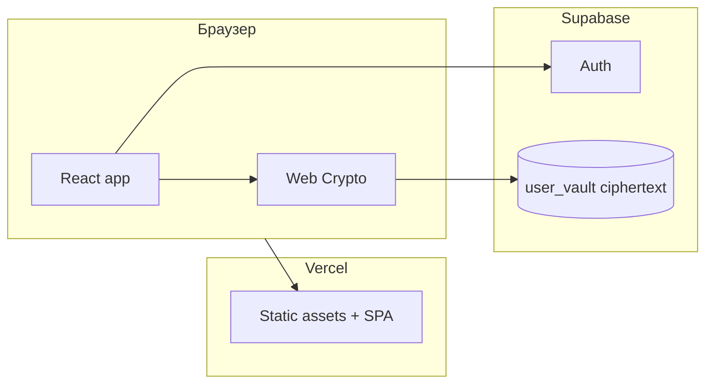

# V1 — минимальный запуск на Vercel

> Цель: **одна собираемая веб-версия**, деплой на **Vercel**, пригодная как основа для полного MVP. Не дублирует [[03-Scope-MVP-и-бэклог]] целиком — это **узкий первый срез**.

**Статус проектирования:** 2026-05-09  
**Код приложения:** каталог `web/` в корне репозитория `planner` (рядом с `obsidian-motivator`). Инструкции по запуску и деплою см. в файле **`web/README.md`** в репозитории.

### Фактическая реализация в `web/` (сверять при изменениях кода)

| Область | Как сделано сейчас |
|---------|---------------------|
| Auth | Email + пароль, вход и регистрация на одном экране. Если Supabase отдаёт регистрацию **без сессии** (включено подтверждение email), показывается сообщение «подтвердите почту», переход на режим входа. |
| Подтверждение email | Рекомендация для разработки: в Supabase выключить обязательное подтверждение или подключить SMTP; иначе лимиты встроенной почты и блокировка входа до клика по ссылке. |
| Онбординг | Два режима: **«Новый seed»** (генерация) и **«У меня уже есть seed»** (вставка base64). Пароль деривации должен совпадать с тем, что использовался при создании vault. |
| Выход | В настройках: сессия сбрасывается и вызывается **очистка seed из `localStorage`**. Без сохранённого seed или без вставки того же seed после следующего входа расшифровка серверного ciphertext невозможна → ошибка в UI. |
| Настройки | Выход; отдельной кнопки экспорта seed в файл пока нет — seed нужно копировать на экране онбординга при первой генерации или из своего хранилища. |
| PWA | **`vite-plugin-pwa`**: web manifest, precache статических ассетов, офлайн-доступ к загруженному UI (данные Supabase без сети по-прежнему недоступны). Иконки в `web/public/pwa-*.png`. |
| Синхронизация vault | После входа ждём **первую загрузку/создание** строки на сервере (`remoteHydrated`), затем разрешаем правки — меньше гонки «пустой upsert перезаписал задачи». Индикаторы: загрузка / сохранение / время последнего успешного сохранения. Редактирование блокируется при ошибке расшифровки vault. |

---

## 1. Цель V1

- Публичный или закрытый URL на **Vercel** (preview + production).
- Один фронтенд-проект: **Vite + React + TypeScript**.
- Подключённый **Supabase** (Auth + одна простая схема хранения), без обязательства закрыть весь MVP.
- Заготовки под **клиентское шифрование** и **RU** интерфейс; в V1 можно ограничиться «скелетом» крипто-онбординга, если иначе не укладываемся — но лучше не откладывать целиком (см. §6).

---

## 2. Границы: входит / не входит

| Входит в V1 (минимум) | Отложено после V1 |
|------------------------|---------------------|
| Сборка, **SPA**, редиректы для клиентского роутера на Vercel; **PWA** (manifest, SW, precache оболочки) | **Offline-first данных** (очередь синка, конфликты — [[13-Черновики-решений]]) |
| **Supabase Auth**: вход (email magic link **или** пароль — выбрать один способ в реализации) | Двойное подтверждение, таймеры [[12-Журнал-решений#DR-004]] |
| Хранение пользовательских данных как **один зашифрованный снимок vault** (JSON → AES-GCM → Postgres) по модели [[12-Журнал-решений#DR-005]] | Нормализованные таблицы задач на сервере в открытом виде |
| CRUD задач **в UI** (список, создание, отметка выполнено, удаление) поверх расшифрованного локального состояния | End-of-day ритуал, КПТ-банк, отчёты с диаграммами |
| Одна страница **настроек**: выход, экспорт seed (заглушка или реальный экспорт), тумблер «шифрование включено» | Push, стрик по полной логике [[12-Журнал-решений#DR-001]], Эйзенхауэр + Inbox [[12-Журнал-решений#DR-003]] |
| **Структура папок** под TanStack Query / Zustand / i18n (можно пустые модули) | Полная реализация offline-конфликтов [[13-Черновики-решений#DR-012 черновик Offline-first конфликты синхронизации]] |

Принцип: **одна сущность на сервере — ciphertext vault**, чтобы не плодить открытые поля и совпасть с [[06-Приватность-и-безопасность]] и [[12-Журнал-решений#DR-007 — Отчёты где считать аналитику]] (метаданные отчётов в V1 не считаем на сервере).

---

## 3. Архитектура деплоя



- **Vercel**: только фронтенд; `vercel.json` — fallback на `index.html` для deep links.
- **Секреты**: в Vercel задаются `VITE_SUPABASE_URL`, `VITE_SUPABASE_ANON_KEY` (не секрет в классическом смысле для anon key, но хранить в dashboard, не в git).

---

## 4. Минимальная схема Supabase

Одна таблица, например `user_vault`:

| Колонка | Тип | Назначение |
|---------|-----|------------|
| `user_id` | uuid, PK, FK → auth.users | Владелец |
| `ciphertext` | bytea / text (base64) | Зашифрованный JSON vault |
| `version` | int | Для оптимистичной блокировки / слияния ([[13-Черновики-решений]]) |
| `updated_at` | timestamptz | Синхронизация |

**RLS:** `user_id = auth.uid()` на select/update/insert/delete.

Содержимое расшифрованного JSON (черновик контракта V1):

```json
{
  "schemaVersion": 1,
  "tasks": [
    {
      "id": "uuid",
      "title": "string",
      "done": false,
      "createdAt": "ISO",
      "updatedAt": "ISO"
    }
  ]
}
```

Расширение полей (цвет, группа, приоритеты) — без ломки `schemaVersion` или с миграцией на клиенте.

---

## 5. Маршруты и экраны V1

| Маршрут | Назначение |
|---------|------------|
| `/` | Редирект на `/app` или `/login` по сессии |
| `/login` | Форма входа Supabase |
| `/onboarding` | Seed + пароль для PBKDF2 ([[12-Журнал-решений#DR-005]]): новый seed или вставка сохранённого base64 |
| `/app` | Список задач + форма добавления |
| `/settings` | Выход, экспорт (минимум текстом), «об аккаунте» |

Библиотека роутинга: **React Router** (легко и предсказуемо для Vercel SPA).

---

## 6. Шифрование в V1

- Реализовать путь **seed → PBKDF2 → ключ AES-GCM** и шифрование/расшифровку всего vault как одного blob.
- Если срок жёсткий: допускается **временный флаг разработчика** «отключить шифрование» только на preview-ветке — **не в production** без явного решения в [[12-Журнал-решений]].

---

## 7. Переменные окружения

Файл в репозитории: `web/.env.example`.

```env
VITE_SUPABASE_URL=https://xxxx.supabase.co
VITE_SUPABASE_ANON_KEY=eyJ...
```

Локально копировать в `web/.env.local` (в `.gitignore`).

---

## 8. Vercel: настройки проекта

- **Root Directory:** `web` (если монорепо остаётся с `obsidian-motivator` в корне).
- **Build Command:** `npm run build`
- **Output Directory:** `dist`
- **Install Command:** `npm ci` или `npm install`

Framework Preset: **Vite** (или Other, если пресет не определился).

---

## 9. Definition of Done для V1

1. `npm run build` в `web/` проходит без ошибок.
2. Production deploy на Vercel открывается по HTTPS.
3. Регистрация/вход работает против реального Supabase проекта.
4. После входа пользователь создаёт задачу, обновляет страницу — данные восстанавливаются из синхронизированного vault.
5. Выход из аккаунта очищает сессию в UI.

---

## 10. Следующий инкремент после V1 (ориентир)

Рекомендуемый порядок:

1. ~~**PWA**~~ — сделано: `vite-plugin-pwa`, manifest, precache shell (см. `web/vite.config.ts`). Полная офлайн-логика данных — по [[13-Черновики-решений]].
2. ~~**Надёжность vault (базово)**~~ — сделано: ожидание первой гидрации, индикаторы, блокировка UI при ошибке расшифровки. Углубление (очередь офлайн, TanStack Query) — при необходимости.
3. **Экспорт/импорт seed в настройках** — файл, QR по [[12-Журнал-решений#DR-005]], предупреждения [[12-Журнал-решений#DR-006]].
4. **MVP-функции** из [[03-Scope-MVP-и-бэклог]]: приоритеты/Эйзенхауэр, двойное подтверждение, ритуал, отчёты на клиенте, push.

---

## Связанные заметки

- [[07-Технический-стек]]
- [[08-Архитектура]]
- [[12-Журнал-решений]]
- [[13-Черновики-решений]]
