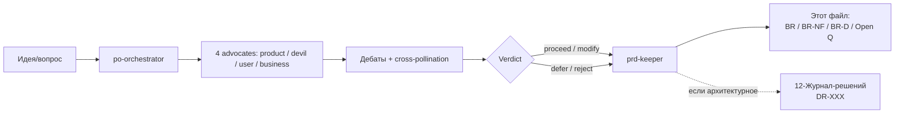

# Business Requirements (BR)

> **Живой документ** продуктовых требований, решений и открытых вопросов.
> **Единственный писатель:** агент [[18-CI-workflow-и-инструменты#4. Локальные QA-агенты|`prd-keeper`]]. Остальные PO-агенты (`product-advocate`, `devil-advocate`, `user-empathy`, `business-advocate`) — предлагают и спорят; этот файл — фиксирует.
> Дебаты ведёт `po-orchestrator` (см. [[18-CI-workflow-и-инструменты]]).

---

## Поток: от идеи до записи

---

## 1. Vision

См. [[01-Видение-и-MVP#Видение]]. Кратко: **личный веб-планировщик, помогающий менять паттерны поведения** (СДВГ / выгорание / прокрастинация).

## 2. Target users

См. [[02-Целевая-аудитория]]. Ключевая персона: **молодые взрослые с СДВГ, выгоранием, низкой self-compassion**.

## 3. Business goals (measurable)

| Goal | Metric | Current | Target | Source |
|---|---|---|---|---|
| Удержать первое использование | D1 retention | TBD | ≥60% | — |
| Превратить в привычку | D7 retention | TBD | ≥30% | — |
| Активация ритуала | % пользователей с ≥1 завершённым EOD за неделю | TBD | ≥40% | [[12-Журнал-решений#DR-013]] |
| Freemium монетизация | Conversion free → paid | TBD | TBD | [[05-Freemium]] |

*(значения «TBD» — заполнятся по мере появления реальных данных в админке)*

## 4. Requirements (functional)

| ID | Requirement | Status | Source |
|---|---|---|---|
| BR-001 | Двойное подтверждение выполнения задач (для борьбы с импульсивностью) | ✅ shipped | [[10-Каталог-функций-и-взаимодействий#Двойное подтверждение]] |
| BR-002 | End-of-Day ритуал с элементами КПТ | ✅ shipped | [[12-Журнал-решений#DR-002]] |
| BR-003 | Стрик как мера регулярности рефлексии, а не успешности задач | ✅ shipped | [[12-Журнал-решений#DR-001]], [[12-Журнал-решений#DR-013]] |
| BR-004 | Онбординг с seed-фразой и восстановлением ключа | ✅ shipped | [[12-Журнал-решений#DR-014]] |
| BR-005 | Две системы приоритетов (1-3 / Эйзенхауэр) на выбор пользователя | ✅ shipped | [[10-Каталог-функций-и-взаимодействий#Системы приоритетов]] |
| BR-006 | EOD-ритуал: интерактивная отметка статуса remaining-задач внутри ритуала (закрытие DR-004) | 📋 planned | [[12-Журнал-решений#DR-017]], BR-D-006 |
| BR-007 | EOD-ритуал: completion overlay с фразой поддержки после завершения ритуала | 📋 planned | BR-D-006 |
| BR-008 | EOD-ритуал: разделение manual vs auto источника в eodCompletedLocalDates для честного стрика | 📋 planned | [[12-Журнал-решений#DR-017]], BR-D-006 |

*(дополнять по ходу — каждое новое BR через дебаты или явное решение пользователя)*

## 5. Requirements (non-functional)

| ID | Requirement | Status | Source |
|---|---|---|---|
| BR-NF-001 | End-to-end шифрование vault (E2E ciphertext) | 🚧 пересмотр | Платный тариф + DR-019; базовый профиль — отдельная модель |
| BR-NF-001a | Гибрид metadata + сейф (push без title в hybrid) | 📋 planned | DR-019, модуль `notify` на Amvera |
| BR-NF-001b | Зашифрованные команды sync (вместо полной перезаливки сейфа) | 📋 planned | DR-019, backlog миграции |
| BR-NF-001c | Миграция инфраструктуры на Amvera (3–4 проекта, модульный API) | 🚧 в процессе | DR-019, ветка `dev` only |
| BR-NF-002 | Offline-first работа | ✅ shipped | [[08-Архитектура#Offline-first]] |
| BR-NF-003 | PWA с web-push-уведомлениями | ✅ shipped | [[08-Архитектура#Push-уведомления (PWA)]] |
| BR-NF-004 | CI gating всех PR (тесты + typecheck) | ✅ shipped (2026-05-31) | [[12-Журнал-решений#DR-016]] |

## 6. Decision history

> Каждая запись — результат debate через `po-orchestrator`. Если решение было принято вне дебатов — это явно отмечено.

### BR-D-001 — Страница админ-панели: Обзор → Сводка (Summary tab)

| Поле | Значение |
|---|---|
| **Дата** | 2026-05-31 |
| **Вердикт** | `proceed-with-modifications` |
| **Advocates** | product: support · devil: oppose→neutral · user: neutral · business: support |
| **Автор записи** | `prd-keeper` (debate через `po-orchestrator`) |

**Вопрос:** Стоит ли сохранять страницу Сводки в текущем виде, упростить, расширить или переосмыслить?

**Резюме:** Страница технически хорошая, но выровнена на SaaS-метрики, а не на миссию продукта. Оставить структуру; добавить behavioural KPI; разграничить admin vs beta view; скрыть trend при < 3 мес. данных.

**Что оставить без изменений:**
- Bento-grid, loading skeletons, danger-стиль для inactive, tooltips — всё правильно
- Vault stale в secondary — retention signal, место верное
- Collapsible activity chart, техническая реализация (kpiTrend Edge fn)

**Согласованные изменения (в порядке приоритета):**
1. Добавить 2 behavioural KPI: «EOD ритуалов за 7д» и «Медиана стрика» — прямое отражение BR Goal №3 (≥40% с EOD за неделю)
2. Добавить контекстный header/пояснение: Summary — owner view, а не beta-view
3. Скрывать trend chart при < 3 мес. данных с сообщением «Недостаточно данных для тренда»

**Живые tensions (зафиксированы, не разрешены полностью):**
- *Масштаб vs инфраструктура:* Devil: тренды при 3-5 пользователях — «theatre». Business: терять исторические данные дороже. Компромисс: инфраструктуру держать, визуализацию порогово скрывать.
- *Freemium-метрики в Summary:* **defer** — добавить только после появления первого платного пользователя.

**Сильнейший контр-аргумент (Devil-Advocate):**
> «MAU-тренд для трёх пользователей — это не инсайт, это симуляция SaaS-панели. Время на её поддержку лучше тратить на продуктовую функциональность для реальных пользователей.»

**Открытые вопросы, порождённые дебатом:**
- [ ] Реализовать ли технически разделение admin-view vs beta-view, или достаточно контекстного header?
- [ ] Какой порог N месяцев для показа trend chart?
- [ ] Добавить ли freemium-метрики как скрытые placeholder с момента появления первого paid user?

### BR-D-002 — Страница админ-панели: Обзор → Сводка (второй независимый взгляд)

| Поле | Значение |
|---|---|
| **Дата** | 2026-05-31 |
| **Вердикт** | `proceed-with-modifications` |
| **Advocates** | product: support · devil: neutral · user: support · business: support |
| **Автор записи** | `prd-keeper` (debate BR-D-002 через `po-orchestrator`) |
| **Примечание** | Независимый второй дебат; BR-D-001 не редактировался |

**Вопрос:** Что в целом думаем о странице AdminDashboardSummaryTab — оставить как есть, упростить, расширить или переосмыслить?

**Резюме:** Архитектурно и UX-технически страница хорошая. Главный диагноз второго дебата — она отвечает не на тот вопрос: показывает SaaS-метрики там, где admin хочет знать «помогает ли продукт людям». Три изменения в порядке приоритета, без новых Edge Functions.

**Что оставить без изменений:**
- Весь технический слой (bento-grid, KPI trend Edge fn, skeleton loading, danger-стиль, activity chart)
- Secondary metrics vault/platform — они несут смысл
- Коллапсируемость activity chart

**Согласованные изменения (в порядке приоритета):**
1. **Threshold в KpiChartZone:** скрывать chart при `series.length < 3`, выводить сообщение «Недостаточно данных для тренда» — честность данных, минимальный риск
2. **Contextual header:** однострочный owner-view лейбл в верху Summary — «Это внутренняя панель владельца; бета-пользователи её не видят»
3. **Воронка как StatGroup:** регистрация → активация (vault created) → MAU — вычислить из существующих полей AdminOverview без новых запросов; EOD-ступень — defer

**Явный defer:**
- EOD-ритуал в hero KPI — отложить до появления поля в AdminOverview (нет backend-поддержки)
- Медиана стрика — отложить по той же причине
- Freemium-метрики — отложить до первого платного пользователя

**Живые tensions второго дебата (зафиксированы, не разрешены):**
- *Devil vs все:* «При 5 пользователях любая аналитика — театр; Supabase Studio раз в неделю дешевле». Остальные парировали: инфраструктура — долгосрочный актив, удалять — дороже на отметке 100 пользователей.
- *EOD сейчас vs defer:* Product хотел немедленно в hero; devil и business объединились — часы работы ради одной цифры при 5 пользователях неоправданы.
- *Воронка расширяет vs нагружает:* Devil принял воронку только при условии «без новых backend-запросов». Условие вошло в решение.

**Сильнейший контр-аргумент (Devil-Advocate, дословно):**
> «MAU-тренд для пяти пользователей — не инсайт, это симуляция SaaS-панели. Activity chart с фильтром по роли — UX для аналитика. Вы один. Вы знаете своих пользователей по имени. Время на поддержку этой красоты лучше тратить на продуктовую функциональность для реальных пользователей.»

**Открытые вопросы, порождённые дебатом:**
- [ ] Есть ли уже поле онбординга в AdminOverview, чтобы сделать воронку из трёх ступеней?
- [ ] Порог series.length для скрытия trend: < 3 или < 4? (сейчас в коде — < 2)
- [ ] Contextual header: текстовый лейбл достаточен или нужен dismissible banner?
- [ ] Когда EOD появится в AdminOverview — сразу в hero KPI или сначала в secondary?

### BR-D-003 — EOD-KPI в Summary tab: триггер расконсервации из defer

| Поле | Значение |
|---|---|
| **Дата** | 2026-05-31 |
| **Вердикт** | `proceed-with-modifications` |
| **Advocates** | product: support · devil: oppose→neutral · user: support · business: support |
| **Автор записи** | `prd-keeper` (debate BR-D-003 через `po-orchestrator`) |
| **Родительский defer** | BR-D-002 (EOD-ритуал в hero KPI отложен «до появления поля в AdminOverview») |

**Вопрос:** Когда именно расконсервировать EOD-KPI (% пользователей с ≥1 завершённым EOD за 7 дней) в Summary tab — какой конкретный триггер?

**Контекст инфраструктуры (на момент дебата):** `AdminOverview` не содержит EOD-полей; `admin_user_activity_daily` фиксирует только heartbeat-активность, не завершения EOD; `buildOverview` в Edge Function считает из vault/push/defects — EOD-агрегата нет нигде.

**Позиции адвокатов:**

- **Product:** инфраструктурный триггер — «когда появляется backend EOD table для self-stats пользователя»; тогда добавить поле в `buildOverview` стоит 1-2 часа. Ждать N пользователей неправильно: теряются исторические данные.
- **Devil:** «При 5 пользователях — театр. Supabase Studio + один SQL-запрос за 3 минуты. Единственный разумный порог — ≥10 non-admin пользователей. До этого — алерт вместо dashboard.»
- **User Empathy:** триггер должен быть составным: инфраструктура И ≥3-5 non-admin пользователей. Иначе метрика информационно пуста.
- **Business:** «Данные нужно собирать прямо сейчас, даже если UI отложен. Жёсткая дата — не позже 2026-08-01, или при первом paying user — что раньше. EOD — прямая цепочка: retention → habituation → EOD-ритуал.»

**Кросс-опыление — ключевые ревизии:**
- Devil сдвинул «никогда» до порога ≥10 non-admin (компромисс с user-empathy)
- Business уточнил: дата 2026-08-01 касается только сбора данных, UI-показ — при ≥5 non-admin
- Product и user-empathy согласились: данные и UI — два разных триггера, путать их нельзя

**Итоговый триггер расконсервации (составной):**

**Для сбора данных (запись EOD-completion в таблицу) — НЕМЕДЛЕННО / не позже 2026-08-01:**
- Как только реализуется self-stats пользователя с EOD-историей, в ту же итерацию добавить запись завершения EOD в отдельное поле/таблицу
- Если self-stats не будет запланирован к 2026-08-01 — реализовать EOD-completion запись принудительно как отдельную задачу

**Для показа в UI (Summary tab) — Условие A ИЛИ Условие B:**
- **Условие A (инфраструктурное + количественное):** backend EOD-completion table/field существует И ≥5 non-admin пользователей — расконсервировать немедленно
- **Условие B (safety net, дата):** 2026-08-01 И ≥5 non-admin пользователей — расконсервировать принудительно

**Размещение при расконсервации:** сначала в secondary StatGroup (не в hero KPI) — снизить риск; в hero KPI переместить после 4 недель наблюдения за метрикой.

**Живые tensions (зафиксированы, не разрешены):**
- *Devil vs все:* «Вы можете зайти в Supabase Studio, написать один SQL-запрос и получить любой агрегат за 3 минуты. Это не масштаб, при котором нужен постоянный KPI в UI.» — Остальные парировали: dashboard нужен для трендинга во времени, алерт этого не даёт.
- *Порог пользователей:* Devil хотел ≥10, user-empathy — ≥3, итог — ≥5 как компромисс. Devil не принял это как «достаточным», лишь «терпимым».
- *Два разных вопроса:* «когда собирать данные» и «когда показывать в UI» оказались разными триггерами; BR-D-002 не разделял их явно — это стало главным инсайтом дебата.

**Сильнейший контр-аргумент (Devil-Advocate, дословно):**
> «Вы можете зайти в Supabase Studio, написать один SQL-запрос и получить любой агрегат за 3 минуты. Это не масштаб, при котором нужен постоянный KPI в UI.»

**Открытые вопросы, порождённые дебатом:**
- [ ] Когда self-stats пользователя планируется в roadmap? — от этого зависит Условие A
- [ ] Какая таблица будет хранить EOD-completion? (`eod_sessions` с полем `completed_at`, или флаг в существующей таблице задач?)
- [ ] При расконсервации: в secondary StatGroup или сразу в воронку активации?
- [ ] Как считать порог «5 non-admin пользователей» — по `total_users` минус `by_role.admin`, или по WAU non-admin?

## 7. Open questions

- [ ] Какова реальная конверсия в платный тариф из freemium? (нужен срез данных из админки)
- [ ] Готов ли продукт к привлечению первых 100 платящих пользователей до конца фазы 8?
- [ ] Нужен ли отдельный режим для нейротипичных пользователей или фокус только на ЦА?
- [ ] **EOD / push-уведомление:** реализован ли Service Worker или Supabase Function для `pushReminderMinutesFromMidnight`? (BR-D-006 — P0 блокер downstream retention)
- [ ] **EOD / offline:** что происходит с `eodCompletedLocalDates` при закрытии браузера до завершения `awaitVaultSync()`? (BR-D-006)
- [ ] **EOD / `includeInEodRitual` дефолт:** есть ли UI для переключения флага в форме редактирования задачи? (BR-D-006)
- [ ] **EOD / КПТ-вопросы:** формат (3 фиксированных или библиотека), модель данных для хранения ответов per-day. (BR-D-006 — defer до закрытия BR-006..BR-008)
- [ ] **EOD / апселл после 14-го ритуала:** какие Premium-инсайты доступны сейчас для наполнения момента апселла? (BR-D-006)
- [ ] **Phase 13 / WeekGrid (BR-D-007 revised):** реализовать «мягкую» сетку (D): дорожка без времени выше сетки, схлопывание ночных часов со счётчиком overflow, цветные карточки; — поставлять в связке с layout (BR-D-010) и сайдбаром (BR-D-012).
- [ ] **Phase 13 / MonthCalendar (BR-D-008 confirmed):** реализовать цветные точки групп; определить API `taskColors` в `PlannerDaySummary` до старта.
- [ ] **Phase 13 / Layout (BR-D-010):** 3-зонный layout десктопа; breakpoints для мобильной деградации; поставлять в связке с BR-D-007 и BR-D-012.
- [ ] **Phase 13 / Фильтры (BR-D-011):** перенести из модалки в постоянный блок «Categories» в левой панели.
- [ ] **Phase 13 / Сайдбар (BR-D-012):** triggered overlay вместо FAB+модалки; mobile = bottom sheet.
- [ ] **Phase 13 / «Стена долга» (BR-D-009 без изменений):** ограничить накопление долга по повторам горизонтом 7 дней; проверить data-модель на различие `overdue` vs `missed`.
- [ ] **Аудитория / спектр персон:** зафиксировать в `02-Целевая-аудитория.md` поправку: СДВГ — одна из персон, не единственная; добавить персону «пользователь с регулярным расписанием». Влияет на все будущие дизайн-решения.
- [ ] См. также [[99-Открытые-вопросы-к-команде]] для общих открытых вопросов.

---

## Как пользоваться этим документом

1. **Возник продуктовый вопрос?** → вызови агента `po-orchestrator` с описанием.
2. **Хочешь записать готовое решение без дебатов?** → вызови `prd-keeper` напрямую; он пометит запись как «unilateral».
3. **Нужна история?** → секция 6 (этот файл) для новых решений, [[12-Журнал-решений]] для исторических DR.

### BR-D-004 — Phase 7: /admin/roadmap редизайн — приоритеты, риски, метрики

| Поле | Значение |
|---|---|
| **Дата** | 2026-05-31 |
| **Вердикт** | `proceed-with-modifications` |
| **Advocates** | product: support · devil: oppose · user: support · business: neutral |
| **Автор записи** | `prd-keeper` (debate BR-D-004 через `po-orchestrator`) |
| **Контекст** | Phase 7, стадия 0.7.x→MVP 1.0.0; 12 рабочих дней; 9 пилларсов |

**Вопрос:** Какие приоритеты, риски и метрики успеха для Phase 7 (/admin/roadmap redesign)?

**Резюме:** Core Phase 7 = 4 пилларса (Data model + Migration, Hero, Timeline, Search) за ~7 дней. Discussions (5 дней в оригинале) defer до явного решения про замену Obsidian-journal. Reminder 24h — reject. 2-col и Footer stats — nice-to-have после core.

**Подтверждённый scope (в порядке приоритета):**

| # | Пиллар | Оценка | Статус | Обоснование |
|---|---|---|---|---|
| 1 | Data model (теги, anchor, current, status, linkedVersion) | ~1 д | **Must — первый** | Foundation-блокер для Timeline и Search |
| 2 | Migration: скрипт + ручная разметка 110 items | ~1.5 д + 4-6 ч ручного | **Must — первый** | Без тегов Timeline — фасад поверх плохих данных |
| 3 | Hero | ~1 д | **Must** | Zero-click context при возврате к проекту |
| 4 | Timeline | ~2 д | **Must** | Навигация по 110 items, anchor-ссылки |
| 5 | Search/filter | ~2 д | **Must** | Мультипликатор Timeline; высокий ROI, малая сложность |
| 6 | 2-col Plan+Ideas | ~1 д | **Nice-to-have** | Current-phase glow + idea statuses; урезать до 1 дня |
| 7 | Footer stats + sparkline | ~1 д | **Nice-to-have** | После Migration (иначе данные неполные) |
| 8 | Discussions / Decision Log | — | **Defer** | Нужно explicit решение про замену Obsidian-journal |
| 9 | Reminder 24h (amber-баннер) | — | **Reject** | Guilt-trip; антипаттерн для СДВГ-ориентированного продукта |

**Definition of Done Phase 7 (явный):**
Hero + Timeline + Search + Data model + Migration — работают и задеплоены. 2-col и Footer stats — бонус если core уложился в 7 дней.

**Топ-3 риска:**

1. **Migration scope** — «скрипт + ручная доработка» = незадекларированный труд. 110 items × ручная разметка = 4-6 часов работы вне оценки. Нужен тайм-бокс до старта.
2. **Два источника истины** — если Decision Log войдёт в scope без явного решения о замене `12-Журнал-решений.md` (Obsidian), admin получит два места для записи решений. Один умрёт.
3. **Отсутствие DoD** — фаза без exit criteria расползётся. DoD зафиксирован в этой записи.

**Метрики успеха Phase 7:**

| Метрика | Базовое значение | Target |
|---|---|---|
| Время-до-контекста (открыть страницу и понять «где я в MVP») | ~3-4 мин (аккордеоны) | <30 сек |
| Частота обновления changelog | <1/нед (friction-барьер) | ≥3 добавлений/нед |
| Search используется | 0 (нет фичи) | ≥1 запрос/нед |

**Anti-фичи (что точно НЕ делать в Phase 7):**
- VAPID push-уведомления (over-engineering для internal tool одного человека)
- Reminder 24h amber-баннер (guilt-trip, противоречит ЦА с СДВГ)
- Replies/threads в Discussions (collaborative feature для non-collaborative tool)
- Расширять Migration за пределы changelog items в текущей фазе
- User-facing фичи — Phase 7 это internal tooling, не смешивать с MVP-фичами

**Живые tensions (зафиксированы, не разрешены):**
- *Discussions vs Obsidian-journal:* Product-advocate предлагает Decision Log (2 дня, без VAPID); devil-advocate возражает — Obsidian-journal уже есть, Decision Log = дублирование. User-empathy: ценно только как **замена** Obsidian-journal. Резолюция: defer до Iteration 2.
- *Reminder 24h:* Devil + Business голосуют reject (punishment mechanism). Product нейтрален. Итог: reject.
- *12 дней на internal tool vs MVP velocity:* Devil-advocate: «goldplating инструмента который смотрит 1 человек». Counter-argument принят — но changelog friction тормозит релизный workflow; Hero + Timeline + Search — инвестиция в собственную продуктивность разработчика.

**Сильнейший контр-аргумент (Devil-Advocate, дословно):**
> «12 рабочих дней за улучшение страницы которую смотрит 1 человек, пока до MVP 1.0.0 ещё 7 фаз работы. Это goldplating internal tooling. Весь этот бюджет можно было потратить на пользовательские фичи — ритуал, задачи, стрик — и приблизиться к реальным пользователям быстрее.»

**Готовность к Iteration 2 (3 trade-off для следующего дебата):**
1. Decision Log: строить (как замену Obsidian) vs не строить
2. Migration: скрипт + автотеггинг vs полностью ручная разметка (trade-off качество vs скорость)
3. 2-col Plan+Ideas: minimal (1 день) vs full layout (2 дня)

**Открытые вопросы, порождённые дебатом:**
- [x] ~~Decision Log vs Obsidian-journal: явное yes/no до начала любого кода для Discussions — заменяем `12-Журнал-решений.md` или нет?~~ → Резолюция в BR-D-005: Hybrid (B2), Obsidian остаётся source of truth, Discussions = рабочий воркспейс
- [x] ~~Migration тайм-бокс: сколько реально часов на ручную разметку 110 changelog items?~~ → Резолюция в BR-D-005: 4-6 ч, зафиксировано в scope 7.1
- [x] ~~Definition of Done Phase 7 — зафиксирован выше; подтвердить с владельцем продукта~~ → Резолюция в BR-D-005: DoD расширен и подтверждён owner-ом
- [x] ~~2-col Plan+Ideas: current-phase glow + idea statuses достаточно, или нужен полный layout?~~ → Резолюция в BR-D-005: полный layout возвращён (owner reject anti-фичей)

### BR-D-005 — Phase 7: финализация scope (owner override + MCP setup)

| Поле | Значение |
|---|---|
| **Дата** | 2026-05-31 |
| **Вердикт** | `proceed` (full scope) |
| **Тип** | Owner decision (overrides BR-D-004 recommendations) |
| **Автор записи** | `prd-keeper` |
| **Контекст** | Финализация open questions из BR-D-004; +новый scope item: MCP setup |

**Решения владельца продукта** (отвечают на open questions BR-D-004):

| Open question | Owner decision | Обоснование |
|---|---|---|
| Reminder 24h: keep or reject? | **Keep (вариант A1)** — fixed 24h + snooze + weekend skip | «Это мой инструмент для меня. Я не ЦА продукта.» Devil-advocate ошибся, проецируя СДВГ-ЦА на разработчика |
| Discussions: replace Obsidian-journal? | **Hybrid (вариант B2)** — Discussions = working workspace, Obsidian-journal = source of truth, ручная sync через статус «К журналу» | Claude должен сохранять read-доступ к decisions. Sync — manual, 5-20 мин копипасты в месяц |
| 12-day scope acceptable? | **Yes, готов на полный scope** | Phase 7 — internal tooling investment, leverage для всего MVP |
| Anti-фичи из BR-D-004 | **Reject** — все фичи возвращаются | Footer stats, sparkline, 2-col, idea statuses — всё нужно |

**Добавлено в scope** (новое относительно BR-D-004):

- **Phase 7.0 — MCP setup** (~0.5 дня): установка Supabase MCP server (`@supabase/mcp-server-supabase`), генерация Personal Access Token с **read-write** доступом, прописывание в `~/.claude/mcp.json` или `/root/.claude/settings.json`. После этого Claude получает direct query access к `admin_discussions` и любым другим Supabase данным.
- **Discussions status «К журналу»** — новый промежуточный статус треда между `open` и `synced`. Жизненный цикл: `open → pending-journal (К журналу) → synced` (+`archived` как side-branch). Pulse-анимация на статусе `К журналу` напоминает админу скопировать резюме в Obsidian-журнал.

**Финальный scope Phase 7 (~15 дней)**:

| # | Sub-phase | Длительность | Заметки |
|---|---|---|---|
| 7.0 | MCP setup | 0.5 д | Supabase MCP, read-write token |
| 7.1 | Data model + Migration (tag/anchor/current/status/linkedVersion) | 1 д | Скрипт автотеггинга + 4-6 ч ручной доработки |
| 7.2 | Hero block (status + What's new + current focus + quick links) | 1 д | |
| 7.3 | Timeline (карточки + tag + anchor + relative time) | 2 д | Anchor links `#v0.7.10` |
| 7.4 | Search/filter sticky bar (query params + debounce) | 2 д | |
| 7.5 | 2-col Plan+Ideas (current-phase glow + idea status chips) | 1 д | |
| 7.6 | Footer stats + sparkline (releases per week) | 1 д | После migration |
| 7.7 | Reminder 24h amber-баннер (snooze + weekend skip) | 0.5 д | Config через localStorage |
| 7.8 | Discussions backend (3 tables + Edge fn + RLS) | 2 д | Migrations 007-009 |
| 7.9 | Discussions UI (list/thread/create/reply/resolve) | 2 д | Markdown body + replies |
| 7.10 | Discussions notifications (push + in-app badge) | 1 д | VAPID + bell badge |
| 7.11 | Sync workflow («К журналу» + linked_journal_entry UI) | 0.5 д | Pulse-анимация на статусе |
| 7.12 | A11y + mobile + perf pass | 1 д | |
| | **Всего** | **15.5 д** | |

**Definition of Done Phase 7** (расширенный):

1. MCP setup завершён, Claude может читать `admin_discussions` через `mcp__supabase__execute_sql`
2. Hero + Timeline + Search + Data model + Migration — задеплоено
3. 2-col Plan+Ideas + Footer stats + Reminder 24h — задеплоено
4. Discussions backend + UI + notifications + sync workflow — задеплоено и протестировано push-уведомлениями
5. ≥1 реальный discussion-thread пройден полным циклом `open → К журналу → synced` с записью в Obsidian-журнал

**Идеи для следующих фаз** (Variant Z/W из обсуждения, **не в Phase 7**):
- Phase 8+ кандидат: Перенос `RELEASE_NOTES_BLOCKS` из code в Supabase + админ-форма создания релиза (≈5 дней)
- Phase 8+ кандидат: Перенос `IDEAS_LATER_ENTRIES` в Supabase + админ-форма управления статусами (≈3 дня)
- Phase 9+ кандидат: Auto-mirror Discussions в markdown (если Variant B1-strict понадобится)
- Phase 9+ кандидат: Public changelog по `RELEASE_NOTES_BLOCKS` (если решат показывать пользователям)

**MCP token security**:
- Token: один токен на проект, ротация — пока не настроена (owner decision)
- Scope: read-write — нужен для миграций и Edge function management
- Storage: `~/.claude/mcp.json` (perms 0600), не коммитится в git
- Backup plan: если токен утечёт — revoke через GitHub Settings → Supabase Personal Tokens, создать новый

**Сильнейший контр-аргумент BR-D-004 (от devil-advocate)** остаётся **зафиксирован для honesty**, но **не блокирует** decision: owner признаёт opportunity cost vs MVP velocity, но считает changelog friction достаточным leverage для всего MVP-процесса.

**Этот record закрывает все open questions из BR-D-004**. Iteration 2 debate — **не нужен**: owner override резолвит trade-offs напрямую.

**Phase 7 ready to start** with sub-phase **7.0 (MCP setup)** as the first executable step.

### BR-D-006 — Отметка выполненных задач в EOD-ритуале: состояние и gap-анализ (2026-06-01)

| Поле | Значение |
|---|---|
| **Дата** | 2026-06-01 |
| **Вердикт** | `proceed-with-modifications` |
| **Advocates** | product: support · devil: support-with-conditions · user: support · business: support |
| **Автор записи** | `prd-keeper` (debate через `po-orchestrator`) |
| **Связанный DR** | [[12-Журнал-решений#DR-017]] |

**Вопрос:** Правильно ли реализована фича «отметка выполненных задач в EOD-ритуале», какие пробелы требуют закрытия?

**Резюме:** Архитектура EOD-ритуала корректна и не требует переосмысления. Разделение EOD-отметки (`eodCompletedLocalDates` — мета-событие «ритуал пройден») и отметки задачи (`task.done` / `completedOccurrenceLocalDates`) обосновано всеми четырьмя адвокатами. Однако фича — скелет без мяса: задачи в `EndOfDayModal` отображаются read-only, что нарушает DR-004; завершение ритуала не даёт обратной связи; `autoCloseAtDayEnd` загрязняет данные стрика.

**Ключевые файлы реализации:**
- `packages/motivator-core/src/lib/eod/eodRitual.ts` — фильтрация и партиционирование задач, расчёт прогресса
- `web/src/components/EndOfDayModal.tsx` — UI ритуала (read-only `EodTaskLine`, кольцо прогресса, кнопка завершения)
- `packages/motivator-core/src/domain/vaultOperations.ts` — `applyCompleteEodForLocalDate` (строки 579–584)
- `web/src/vault/VaultProvider.tsx` — `completeEodForLocalDate`, sync с Supabase
- `web/src/pages/AppPage.tsx` — инициализация, выбор режима `ritual` / `report`

**Поток (задокументирован для future-me):**
1. AppPage проверяет `eodCompletedLocalDates.includes(todayKey)` → выбирает режим ritual/report
2. EndOfDayModal партиционирует задачи на completed/remaining/backlog, рассчитывает `doneFraction`
3. Кнопка «Завершить ритуал» → `onCompleteRitual()` → `completeEodForLocalDate(dateKey)` → `applyCompleteEodForLocalDate` → Supabase
4. После сохранения модал закрывается; следующее открытие — mode='report'

**Согласованные изменения (приоритизированный список, все четыре адвоката согласились):**

1. **`onToggleTask` в `EndOfDayModal` для remaining-задач** — пробросить callback из AppPage, в `EodTaskLine` добавить кнопку только для `done=false` в режиме `ritual`. Закрывает DR-004.
2. **Completion overlay** — локальный state `isCompleting` в `EndOfDayModal`, после `await onCompleteRitual()` показывать полноэкранный fade-overlay 2 секунды с i18n-фразой поддержки. Закрывает петлю обратной связи для ЦА с СДВГ.
3. **Разделение manual vs auto в `eodCompletedLocalDates`** — добавить поле `source: 'manual' | 'auto'` к каждой записи или отдельный массив `eodAutoCompletedLocalDates`; ReportsPage и стрик считают только `manual`. Закрывает риск data corruption от `autoCloseAtDayEnd`.
4. **Переставить секции в модале** — сначала completed, потом remaining; backlogReminder убрать из режима `ritual` (оставить только в `report`). Одно изменение JSX.
5. **КПТ-вопросы** — defer до закрытия пунктов 1–3. Инфраструктура готова, добавлять поверх дырявого фундамента нецелесообразно.

**Ключевая точка расхождения (разрешена):**
Product-advocate ставил первым КПТ-вопросы («ритуал без рефлексии не является ритуалом»). Devil-advocate возразил: DR-004 зафиксирован в decision log, добавлять контент поверх read-only ритуала — накладывать слои на нерешённый долг. Позиция devil-advocate принята как более сильная: DR-долг первичен перед продуктовым расширением.

**Точка расхождения по autoClose (разрешена):**
Devil и business видят в `applyAutoCompleteEodForElapsedPlannerDays` риск — инвариант «`eodCompletedLocalDates` = факт участия пользователя» нарушается. Принято: два источника должны быть разделены, иначе продукт «лжёт» ЦА с СДВГ эмоционально значимым образом.

**Сильнейший контр-аргумент (Devil-Advocate):**
> «Ритуал завершения дня без момента завершения — это форма без содержания. Кнопка закрывает модал в никуда. Для пользователя с СДВГ отсутствие петли обратной связи означает отсутствие привычки.»

**Открытые вопросы, порождённые дебатом:**
- [ ] Push-уведомление EOD: реализован ли браузерный Service Worker или Supabase Function для `pushReminderMinutesFromMidnight`? Без ответа невозможно оценить реальный retention от EOD.
- [ ] Offline-гарантия: что происходит если `completeEodForLocalDate` выполнился локально (`mutate`), но `awaitVaultSync()` не завершился до закрытия браузера? Оптимистичная запись сохраняется или теряется?
- [ ] `includeInEodRitual` по умолчанию: флаг фильтрует задачи через `!== false`, т.е. дефолт — участвует в ритуале. Есть ли UI для переключения в форме редактирования задачи? Видит ли новый пользователь весь список или 2-3 задачи?
- [ ] КПТ-вопросы: описаны в `04-User-Stories` как ключевая часть EOD, в коде отсутствуют. Фиксированные 3 вопроса или библиотека? Нужно ли хранить ответы per-day?
- [ ] Апселл после 14-го ритуала: какие Premium-инсайты доступны сейчас? Если нет — момент апселла нечем наполнить.

### BR-D-007 — Phase 13: WeekGrid — «мягкая» почасовая сетка для спектра персон

| Поле | Значение |
|---|---|
| **Дата** | 2026-06-22 |
| **Вердикт** | `proceed-with-modifications` (ревизия: вариант C ПЕРЕСМОТРЕН → «мягкая» сетка D) |
| **Advocates** | product: support(D) · devil: neutral→условный(D) · user: strong support(D) · business: support/weak(D) |
| **Автор записи** | `prd-keeper` (повторный debate через `po-orchestrator`, 2026-06-22) |
| **История** | Первичный вердикт 2026-06-22: вариант C (убрать сетку, компактные колонки). Пересмотрен в тот же день по итогам повторного прогона с учётом (а) поправки по аудитории и (б) референса Dribbble Gotoinc Healthcare Calendar. |

**Поправка по аудитории (критическая):** ЦА — широкий спектр. СДВГ — лишь ОДНА из персон. Есть пользователи с регулярным расписанием (встречи, работа 9-18, учёба, спорт), которым тайм-блокинг и почасовая сетка ПОЛЕЗНЫ. Первичное решение (вариант C) ошибочно оптимизировало только под СДВГ-персону.

**Вопрос:** Как WeekGrid должна работать для спектра персон — оставить полные 24h, убрать сетку (C) или сделать «мягкую» адаптивную сетку (D)?

**Контекст (аудит прод-сборки):** WeekGrid рендерит полные 24h (~1000px вертикали), почти всегда пустая. Задачи без временного слота сжаты в обрезанную шапку над сеткой. Реальные события в слот редко попадают.

**Рекомендованный вариант: D — «мягкая» адаптивная сетка** (пересматривает вариант C):
- Почасовая сетка сохраняется, но схлопывает пустые ночные часы (настраиваемый диапазон, по умолчанию 0:00–7:00 и 22:00–23:59)
- Задачи без временного слота — в отдельной приоритетной дорожке ВЫШЕ сетки (не подвал, не шапка, отдельная секция с заголовком)
- Схлопнутые часы ОБЯЗАТЕЛЬНО показывают счётчик вложенных событий («+ N событий») с раскрытием одним кликом
- Задачи в сетке — цветные карточки по группам (из дизайн-системы Motivator 2.0, `TASK_COLOR_HEX`)
- Повторы без времени — в дорожке «без времени», а не в сетке
- Инлайн «+ Add» в пустых слотах сетки для тайм-блокинга

**Консенсус адвокатов:**
- **Product:** ревизировал позицию. Принял коллапсируемость правого сайдбара и обязательный счётчик overflow. Тайм-блокинг без внешнего инструмента — ключевая ценность для структурных пользователей.
- **Devil:** смягчил с oppose до neutral с условиями. Killer objection: схлопывание без счётчика = невидимые слоты (ночные смены, импорт). Условие: счётчик overflow — часть MVP-поставки, не backlog. Финальный killer objection: три изменения (layout + сетка + сайдбар) нужно поставлять вместе; промежуточный state хуже исходного.
- **User:** strong support. Дорожка «без времени» ВЫШЕ сетки — принципиально. Прятать задачи без времени ниже сетки = «делаешь это неправильно» — удар по мотивации СДВГ-персоны. 584px сжатой главной зоны — катастрофа для СДВГ-мозга.
- **Business:** support/weak. Структурные пользователи — вероятно доминирующий платящий сегмент. Рискованное допущение снижено с «высокого» до «среднего».

**Что НЕ делать:**
- Вариант C (убрать сетку полностью) — режет структурных пользователей, которые нуждаются в тайм-блокинге
- Вариант B (аккордеон) — лишний state + edge-кейсы при скролле
- Схлопывание без счётчика overflow — невидимые данные, потеря доверия

**Критерии успеха:**
- Пользователь со структурным расписанием видит слоты 8:00-20:00 без прокрутки через пустую ночь
- Пользователь без расписания видит свои задачи в дорожке «без времени» выше сетки, без ощущения «пустой ежедневник»
- Схлопнутые слоты показывают «+N событий» если там что-то есть
- Mobile 375px: дорожка «без времени» занимает первый экран; сетка — ниже по прокрутке

**Открытые вопросы:**
- [ ] Какой диапазон «ночных» часов схлопывается по умолчанию — 0-7 и 22-24? Настраивается ли пользователем?
- [ ] Drag-and-drop в сетке — premium-фича? Если да — архитектурный хук нужен до реализации D.
- [ ] Какой заголовок дорожки «без времени» — «Задачи дня», «Без времени», «Весь день»?
- [ ] Импорт из внешних calendar-источников (iCal) — как события в схлопнутом диапазоне попадут в счётчик?

### BR-D-008 — Phase 13: MonthCalendar — цветные точки групп (подтверждено с уточнением)

| Поле | Значение |
|---|---|
| **Дата** | 2026-06-22 |
| **Вердикт** | `proceed-with-modifications` (вариант C подтверждён; уточнение по контексту 3-зонного layout) |
| **Advocates** | product: пересмотрен с moderate(мини-карточки) → support(C) · devil: neutral→conditional(C) · user: support(C) · business: strong support(C) |
| **Автор записи** | `prd-keeper` (повторный debate через `po-orchestrator`, 2026-06-22) |
| **История** | Первичный вердикт 2026-06-22: вариант C (цветные точки). Подтверждён в повторном прогоне; product-advocate пересмотрел moderate support мини-карточек → полный support точек после cross-pollination. |

**Поправка по аудитории:** Месяц — навигационный инструмент для всего спектра персон, не планировочный. Задача пользователя: «в эту среду что-то есть?» — не «что именно».

**Вопрос:** Что показывать в ячейке дня MonthCalendar — счётчики, цветные точки или мини-карточки с текстом?

**Рекомендованный вариант: C — цветные точки по группам** (подтверждён):
- Цветные точки/полоски по группам задач (`TASK_COLOR_HEX`) без текстового содержимого
- Сохранить число и подпись «долг/открыто/выполнено»
- Cap: максимум 5 точек, при переполнении «…»
- Guard: точки не появляются при 0 задачах с группой

**Консенсус адвокатов (все четыре, после cross-pollination):**
- **Product:** пересмотрел позицию по мини-карточкам. «Смотрю чтобы почувствовать» (user-empathy) точнее. Точки дают ощущение плотности при 30-40% стоимости. Мини-карточки — только при появлении данных, что пользователи читают, а не сканируют месяц.
- **Devil:** снял objection по ширине ячеек при 3-зонном layout. Новый risk: мини-карточки создают ожидание интерактивности (drag, resize) без плана реализации → UX-долг. C этого риска лишён.
- **User:** «смотрю на месяц не чтобы читать, а чтобы почувствовать насыщенность дня» — точки достаточны.
- **Business:** strong support точек — 80% ценности за 30-40% стоимости. Мини-карточки — premature investment.

**Что НЕ делать:**
- Вариант B (мини-карточки с текстом): overflow-проблема выбора «какие 3 показать», плюс создаёт ожидание интерактивности.
- Вариант A (только счётчики): «иллюзия информации» без цветового контекста.

**Архитектурное следствие (без изменений):** MonthCalendar принимает только `daySummaries` — нужно добавить `taskColors: string[]` в `PlannerDaySummary` или отдельный проп. Решить до реализации.

**Критерии успеха:**
- Пользователь одним взглядом видит цветовые группы задач дня
- Пустой день — дашированная граница без точек
- Точки консистентны с цветами в WeekGrid и левой панели Categories

**Открытые вопросы:**
- [ ] API: расширить `PlannerDaySummary.taskColors: string[]` или отдельный проп?
- [ ] Tooltip по клику на ячейку — в итерацию C или defer?
- [ ] Cap точек: 5 или по числу групп (max 8 в Motivator 2.0)?

### BR-D-009 — Phase 13: «Стена долга» — ограничение накопления повторяющихся задач

| Поле | Значение |
|---|---|
| **Дата** | 2026-06-22 |
| **Вердикт** | `proceed-with-modifications` (вариант C как фундамент; D — следующая итерация) |
| **Advocates** | product: support(B+D) · devil: strongly support(C) · user: support(C) · business: support(C) |
| **Автор записи** | `prd-keeper` (debate через `po-orchestrator`) |

**Вопрос:** Как отображать «долг» прошлых дней, когда повторяющиеся задачи накапливаются и делают весь прошлый месяц красным?

**Контекст (аудит):** Повторяющиеся задачи копятся исторически; закрывать их задним числом нельзя. Прошлые дни месяца = сплошной красный «долг N». Конфликт с ТЗ фазы 13: «не пугать зря».

**Рекомендованный вариант: C** — ограничить накопление долга по повторам. Пропущенный повтор не должен тянуться в «долг» дальше разумного горизонта (рекомендуемый threshold: 7 дней). За горизонтом — задача переходит в состояние «пропущено», а не «долг».

**Обоснование (консенсус devil, user, business против product):**
- **Devil:** только C меняет поведение системы, а не косметику. «Если система честно показывает весь накопленный долг и это пугает — значит долг реален. Но накопление повторов механически — это не честность, это баг UX.»
- **User:** CSS opacity (B) — ложь комфорта; если пользователь обнаружит скрытый долг позже — удар сильнее. C устраняет источник проблемы.
- **Business:** «Стена долга» — retention killer на кривой неделя 2–4; C меняет поведение, а не маскирует. ROI: средний (требует логики в core), но нет альтернативы без риска abandonment.
- **Product** (оппозиция): предлагал B+D вместе. Принято частично: D (разделение типов просрочки) — следующая итерация после C.

**Что НЕ делать:**
- Вариант A (оставить как есть): самый опасный для retention. Стыд-триггер у ЦА с СДВГ = удалить приложение.
- Вариант B (CSS opacity): ложь комфорта; не меняет данные, скрывает проблему визуально.

**Следующая итерация (D, defer):** визуально отделять «настоящие невыполненные разовые» от «пропущенных повторов» — требует типизации просрочек на уровне модели данных (`overdue_type: 'single' | 'repeat'`). Реализовывать поверх C, не вместо него.

**Killer objection (devil-advocate, зафиксирован):**
> «Если data-модель не хранит различие между "срок не установлен" и "срок пропущен", ни один из визуальных вариантов не даст честной картины.» Проверить модель до реализации C.

**Критерии успеха:**
- Повтор, пропущенный более 7 дней назад, не учитывается как «долг» в ячейках прошлых дней
- Прошлые недели месяца без красного покрова по повторам (разовые просрочки остаются маркированными)
- Пользователь, открывающий приложение после недели перерыва, видит «сегодня», а не «7 × долг N»

**Открытые вопросы, порождённые дебатом:**
- [ ] Какой threshold для «горизонта» повтора: 7 дней? 14? Нужен ли он конфигурируемым пользователем?
- [ ] Как изменить `PlannerDaySummary.overdue` — исключать повторы старше N дней или добавить отдельный счётчик `overdueRecurring`?
- [ ] Когда повтор переходит в «пропущено» — он исчезает из очереди задач или остаётся с другим статусом?
- [ ] Реализация D (разделение типов): добавить `overdue_type` в task-модель до Phase 14 или внутри Phase 13?

### BR-D-010 — Phase 13: 3-зонный layout десктопа — икон-рейл + левая панель + главная зона + правый сайдбар

| Поле | Значение |
|---|---|
| **Дата** | 2026-06-22 |
| **Вердикт** | `proceed-with-modifications` |
| **Advocates** | product: support · devil: oppose→neutral (с условиями) · user: support · business: support (в связке с BR-D-011) |
| **Автор записи** | `prd-keeper` (debate через `po-orchestrator`, 2026-06-22) |
| **Референс** | Dribbble «Healthcare Dashboard: Calendar / Staff View», Gotoinc (структура блоков, не цветовая палитра) |

**Вопрос:** Принять ли 3-зонный layout референса как целевую структуру десктопа «Мотиватора»?

**Текущее состояние:** контент max-w 1200px, боковое пространство пустует на wide-screen. Все элементы (фильтры, создание, навигация) скрыты за модалками/FAB.

**Рекомендованная целевая структура:**
1. **Икон-рейл** — узкий (~56px), постоянная навигация между разделами приложения
2. **Левая панель (~280px)** — мини-календарь (навигатор дат + подсветка сегодня) + блок «Categories» (постоянные цветные тоглы-фильтры по группам) + блок «Сегодня» (агенда текущего дня списком)
3. **Главная зона** — тулбар (‹ Today ›, диапазон дат, сегментированный переключатель Day/Week/Month) + содержимое выбранного вида (WeekGrid по BR-D-007, MonthCalendar по BR-D-008)
4. **Контекстный правый сайдбар (~360px)** — открывается ТОЛЬКО по триггеру (клик на задачу, клик на слот, кнопка «+»); для создания/редактирования задачи; по умолчанию ЗАКРЫТ

**Цветовая система:** берётся СТРУКТУРА БЛОКОВ из референса. Цветовая палитра — дизайн-система Motivator 2.0 (изумруд #4edea3, `TASK_COLOR_HEX` для групп), НЕ копируется тёмная палитра референса.

**Позиции адвокатов:**
- **Product:** support. Снижает число кликов до целевого действия с 3-5 до 0-1. Каждая персона получает ориентир с первого взгляда. Принял условие коллапсируемости сайдбара.
- **Devil:** смягчил с oppose до neutral. Killer condition: сайдбар — triggered overlay, не постоянная колонка. На 1280px три постоянные панели (56+280+360=696px overhead) оставляют главной зоне лишь 584px — неприемлемо. Финальный killer objection: layout + WeekGrid + сайдбар должны поставляться вместе; промежуточный state хуже исходного.
- **User:** support. Постоянная левая панель снижает навигационную нагрузку для обеих персон. 584px главной зоны — катастрофа для СДВГ-мозга; именно поэтому сайдбар по триггеру критичен.
- **Business:** support только в связке с BR-D-011 (фильтры в левой панели) и BR-D-007 (мягкая сетка). Layout сам по себе пустую сетку не конвертирует в retention.

**Мобильная деградация (обязательно):**
- < 1024px: левая панель коллапсируется в drawer по свайпу/кнопке
- < 768px: икон-рейл → bottom navigation bar; правый сайдбар → bottom sheet

**Критерии успеха:**
- На 1440px+: все 4 зоны видны одновременно без горизонтального скролла
- На 1280px: левая панель + главная зона без сайдбара (сайдбар закрыт по умолчанию); главная зона ≥ 700px
- На 375px (мобила): только главная зона, навигация снизу

**Открытые вопросы:**
- [ ] Левая панель — всегда фиксированная или коллапсируемая на десктопе тоже (user preference)?
- [ ] Блок «Сегодня» в левой панели — показывать только при выборе Week/Month или всегда?
- [ ] Breakpoint коллапса левой панели: 1024px или 1280px?

### BR-D-011 — Phase 13: Фильтры из модалки → постоянная левая панель «Categories»

| Поле | Значение |
|---|---|
| **Дата** | 2026-06-22 |
| **Вердикт** | `proceed-with-modifications` |
| **Advocates** | product: strong support · devil: neutral (с мобильным условием) · user: support (нейтрален для СДВГ) · business: strong support |
| **Автор записи** | `prd-keeper` (debate через `po-orchestrator`, 2026-06-22) |

**Вопрос:** Перенести ли фильтры по группам из модалки-overlay в постоянный блок «Categories» с цветными тоглами в левой панели?

**Рекомендация: proceed** — перенести в левую панель как постоянный блок.

**Позиции адвокатов:**
- **Product:** strong support. Модалка разрывает поток: открыть → применить → закрыть. Постоянные тоглы = один клик без потери контекста. Цвет тогла = цвет карточки в WeekGrid — система читается как единая.
- **Devil:** neutral. Допущение: фильтры используются достаточно часто. Риск: 80% сессий фильтры не трогают → панель как мёртвый балласт. Условие: на < 1024px панель автоматически коллапсируется.
- **User:** support (нейтрален для СДВГ). Структурным пользователям постоянные фильтры нужны ежедневно. СДВГ-персона перестаёт их замечать — это нейтрально, не плохо. Плохо если они занимают визуальный вес в ущерб мини-календарю.
- **Business:** strong support. Самый дешёвый ROI (1 день разработки, +10-15% кликов на фильтрацию, снижает friction daily engagement).

**Критерии успеха:**
- Переключение видимости группы — один клик без модалки
- Цвет тогла консистентен с цветом карточки в сетке и точки в месяце
- На мобиле — в составе drawer-панели

**Мобильная деградация:** в составе drawer-панели (левая панель коллапсируется в drawer на < 1024px).

**Открытые вопросы:**
- [ ] Порядок групп в Categories — по алфавиту, по частоте использования, drag-to-reorder?
- [ ] «Выбрать все» / «Снять все» — нужна ли кнопка массового выбора?
- [ ] Состояние фильтров — в URL params или только в local state?

### BR-D-012 — Phase 13: Контекстный правый сайдбар вместо FAB+модалки

| Поле | Значение |
|---|---|
| **Дата** | 2026-06-22 |
| **Вердикт** | `proceed-with-modifications` |
| **Advocates** | product: support · devil: neutral (trigger-only) · user: support · business: support/strong (после ревизии) |
| **Автор записи** | `prd-keeper` (debate через `po-orchestrator`, 2026-06-22) |

**Вопрос:** Перенести ли создание/редактирование задачи из FAB+модалки в контекстный правый сайдбар?

**Ключевое условие:** сайдбар открывается ТОЛЬКО по триггеру (клик на задачу / клик на слот «+» / кнопка «+»). По умолчанию — ЗАКРЫТ. Это не постоянная третья колонка.

**Рекомендация: proceed-with-modifications** — реализовать сайдбар как triggered overlay.

**Позиции адвокатов:**
- **Product:** support. Сохраняет пространственную связь «вижу слот → ставлю туда задачу». Пользователь держит контекст дня и заполняет форму параллельно. Принял triggered-overlay как уточнение, не отступление.
- **Devil:** смягчил до neutral при условии triggered overlay. Главный risk снят: постоянно открытый сайдбар на 1280px оставляет 584px главной зоне — неприемлемо. Overlay не занимает место по умолчанию. Killer objection (сохраняется): layout + сетка + сайдбар должны поставляться вместе.
- **User:** support. СДВГ-персона: «Модалка выбивает из контекста. Открыл — забыл зачем». Сайдбар сохраняет контекст сетки при создании. Структурный пользователь: «вижу занятые слоты, пока заполняю новую задачу».
- **Business:** пересмотрел до strong support. Триггер-открытие устраняет риск сжатия главной зоны, сохраняет retention-сигнал тайм-блокинга. Рискованное допущение (пользователи создают задачи часто) — сохраняется, требует валидации.

**Мобильная деградация:** на < 768px — bottom sheet (стандартный паттерн iOS/Android).

**Что НЕ делать:**
- Постоянно открытый сайдбар по умолчанию
- Сайдбар как split-view с resize — scope creep

**Критерии успеха:**
- Открытие по клику на слот или задачу без скрытия основной сетки
- Закрытие по ESC / Cancel / сохранению
- На мобиле — bottom sheet

**Открытые вопросы:**
- [ ] Вкладки в сайдбаре: «Задача / Повтор / Событие» — нужны ли, или одна универсальная форма?
- [ ] Inline редактирование в сетке (клик на задачу → поля редактируются прямо в карточке) — альтернатива сайдбару или дополнение?
- [ ] FAB остаётся как fallback на мобиле или заменяется «+» в тулбаре?

