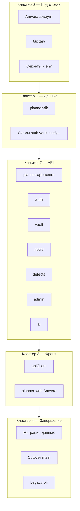

# План миграции: Vercel + Supabase → Amvera (мастер-план)

**Статус:** 📋 План (реализация на ветке `dev`)  
**Решение-рамка:** [[12-Журнал-решений#DR-019 — Миграция Amvera: ветки, архитектура, уровни шифрования (2026-06-24)]]  
**Архитектура:** [[08-Архитектура#Миграция на Amvera (DR-019)]]  
**Ветки:** весь переезд — **`dev`**; **`main`** — legacy (Vercel+Supabase) до cutover.

---

## 1. Цель и граница проекта

| До cutover | После cutover |
|------------|---------------|
| `main` → Vercel + Supabase Cloud | `main` → Amvera (`planner-web`, `planner-api`, `planner-db`, cron) |
| `dev` → гибрид / stage Amvera + разработка API | `dev` → preprod / интеграция перед релизом |
| Фронт: `@supabase/supabase-js` | Фронт: `apiClient` → `planner-api` |
| Edge Functions (9 шт.) + Vercel cron proxy (2 шт.) | Модули `planner-api` + Amvera Cron Jobs |
| Postgres + `auth.users` + RLS + Storage + `pg_net` | Postgres Amvera; схемы по модулям; файлы на `/data` или S3 |

**Критерий «переезд завершён» (Definition of Done):** чеклист в [[#12. Cutover и merge в main]] выполнен; Supabase и Vercel **отключены** для prod; smoke prod пройден 48 ч.

---

## 2. Кластеры работ (карта)



| Кластер | ID | Содержание | Проект Amvera |
|---------|-----|------------|---------------|
| **0. Подготовка** | 0.x | Аккаунт, проекты, Git, документация, дизайн free/paid шифрования | — |
| **1. База** | 1.x | PostgreSQL, миграции, роли, без `auth.uid()` | `planner-db` |
| **2. API — каркас** | 2.x | Монорепо `services/planner-api`, health, JWT middleware, порты | `planner-api` |
| **3. API — auth** | 3.x | Регистрация, login, refresh, email, роли | `planner-api` |
| **4. API — vault** | 4.x | GET/PUT ciphertext, тарифы, encrypted commands (этап 2) | `planner-api` |
| **5. API — notify** | 5.x | push_subscriptions, fire_requests, send-due, test push | `planner-api` + cron |
| **6. API — defects** | 6.x | drafts, files, GitHub issues, cleanup | `planner-api` + cron |
| **7. API — admin** | 7.x | users, activity, discussions, notify subscribers | `planner-api` |
| **8. API — AI** | 8.x | Groq / Amvera LLM proxy | `planner-api` |
| **9. Фронт** | 9.x | apiClient, feature flags, Amvera web | `planner-web` |
| **10. Миграция данных** | 10.x | Экспорт Supabase → импорт Amvera | `planner-db` |
| **11. Cutover** | 11.x | DNS, prod projects, smoke | все |
| **12. Legacy off + main** | 12.x | Отключить Vercel/Supabase, merge `dev`→`main` | — |

---

## 3. Инвентарь legacy (что заменяем)

### 3.1. Edge Functions → модули API

| Legacy (Supabase Edge) | Модуль API | Приоритет |
|------------------------|------------|-----------|
| — (GoTrue) | `auth` | P0 |
| — (`user_vault` direct) | `vault` | P0 |
| `send-due` | `notify` + cron | P0 |
| `notifications-test` | `notify` | P1 |
| `admin-record-activity` | `admin` | P1 |
| `admin-motivator-roles` | `admin` | P1 |
| `admin-discussions` | `admin` | P2 |
| `admin-discussions-notify` | `admin` + `notify` (вместо `pg_net`) | P2 |
| `file-defect` | `defects` | P2 |
| `defect-attachments-cleanup` | `defects` + cron | P2 |
| `ai-task-assistant` | `ai` | P3 |

### 3.2. Прямой доступ фронта к Supabase (файлы)

| Файл / зона | Что уходит на API |
|-------------|-------------------|
| `AuthProvider.tsx` | `/api/auth/*` |
| `supabaseVaultRemote.ts` | `/api/vault` |
| `syncNotificationSchedule.ts`, `pushSubscription.ts` | `/api/notify/*` |
| `hasRemoteVault.ts` | `GET /api/vault/meta` или head |
| `FileDefectModal.tsx` (storage + drafts) | `/api/defects/*` multipart |
| `useFileDefect.ts` | `POST /api/defects/submit` |
| `admin/*` (invoke) | `/api/admin/*` |
| `useAiChat.ts`, `useSpeechInput.ts` | `/api/ai/*` |
| `adminActivityPing.ts` | `POST /api/admin/activity` |

### 3.3. SQL-миграции (14 файлов) → схемы Amvera

| Файл | Целевая схема | Примечание |
|------|---------------|------------|
| `001_user_vault` | `vault` | убрать FK `auth.users`, RLS → API |
| `002_notifications`, `004_*` | `notify` | |
| `003_defect_reports` | `defects` | Storage → `/data` |
| `006_admin_user_activity_daily` | `admin` | |
| `007_admin_role_audit_log` | `admin` / `auth` | |
| `008`–`011`, `012`–`015` discussions | `admin` | триггер `pg_net` → HTTP из API или job |

### 3.4. Vercel

| Артефакт | Замена |
|----------|--------|
| `vercel.json` (SPA) | nginx Browser Amvera |
| `api/send-due-cron.js` | Amvera Cron → `planner-api/internal/cron/send-due` |
| `api/defect-attachments-cleanup-cron.js` | Amvera Cron → `.../defect-cleanup` |
| Env `VITE_*` на Vercel | `build.additionalCommands` + runtime env Amvera |

---

## 4. Кластер 0 — Подготовка (Amvera, Git, решения)

### 0.1 Регистрация и доступ Amvera

| # | Шаг | Результат |
|---|-----|-----------|
| 0.1.1 | Создать аккаунт Amvera, подтвердить оплату/пробный тариф | Вход в ЛК работает |
| 0.1.2 | Зафиксировать имя пользователя Amvera (для internal DNS) | Запись в README / runbook |
| 0.1.3 | Создать **4 пустых проекта** (имена латиницей): `planner-web`, `planner-api`, `planner-db`, `planner-jobs` | 4 проекта в ЛК |
| 0.1.4 | Для каждого проекта: привязать GitHub `Chuchumbrik/planner`, ветка **`dev`**, корень репо | Webhook push → сборка (пока может падать — ок) |

### 0.2 Ветка и политика merge

| # | Шаг | Результат |
|---|-----|-----------|
| 0.2.1 | Убедиться: ветка `dev` на GitHub актуальна (`amvera.yaml`, `build-amvera.mjs`) | `origin/dev` существует |
| 0.2.2 | Защита `main`: не мержить PR из миграции до этапа 12 | Правило зафиксировано в DR-019 + этот план |
| 0.2.3 | CI (`pr-checks`) гоняется на PR в **`dev`** | Зелёный baseline на `dev` |

### 0.3 Продуктовые решения до кода vault (блокер 4.x)

| # | Шаг | Результат |
|---|-----|-----------|
| 0.3.1 | Утвердить модель **базового (free) тарифа**: plaintext в API vs облегчённое шифрование | ADR-дополнение к DR-019 |
| 0.3.2 | Утвердить модель **платного E2E**: вкл/выкл, поля в `auth.users` / `subscriptions` | Схема `auth` |
| 0.3.3 | Обновить черновик политики конфиденциальности под два тарифа | Чеклист юридики до cutover |
| 0.3.4 | Зафиксировать MVP sync: **полная перезаливка сейфа** (сейчас) → **encrypted commands** (этап 4.5, не блокер cutover) | Приоритет в backlog |

### 0.4 Секреты и runbook

| # | Шаг | Результат |
|---|-----|-----------|
| 0.4.1 | Таблица секретов: JWT secret, SMTP, VAPID, GROQ, GITHUB, CRON_SECRET, DATABASE_URL | `docs/amvera-secrets.md` или раздел README (не значения в git) |
| 0.4.2 | SMTP: выбрать провайдера (RU-доставка), тестовое письмо | Рабочий SMTP в stage |
| 0.4.3 | Экспорт списка пользователей Supabase Auth (csv/admin) для планирования миграции | Файл у команды, не в git |

**Результат кластера 0:** проекты Amvera созданы, `dev` — единственная ветка разработки, решения по шифрованию free/paid записаны, runbook секретов есть.

---

## 5. Кластер 1 — База данных (`planner-db`)

### 1.1 Проект PostgreSQL на Amvera

| # | Шаг | Результат |
|---|-----|-----------|
| 1.1.1 | Создать managed PostgreSQL в проекте `planner-db` | Инстанс Running |
| 1.1.2 | Записать internal host (`amvera-*-cnpg-*-rw`) и credentials | В секретах Amvera `planner-api` |
| 1.1.3 | Проверить подключение с локальной машины / временного скрипта | `SELECT 1` успешен |

### 1.2 Схемы и роли

| # | Шаг | Результат |
|---|-----|-----------|
| 1.2.1 | Создать схемы: `auth`, `vault`, `notify`, `defects`, `admin` | `\dn` показывает 5 схем |
| 1.2.2 | Создать роли: `auth_svc`, `vault_svc`, `notify_svc`, `defects_svc`, `admin_svc` с `search_path` только своей схемы | Роли без superuser |
| 1.2.3 | Добавить `services/planner-api/migrations/` с нумерацией по схемам | Папка в репо на `dev` |

### 1.3 Миграции по модулям (адаптация SQL)

| # | Шаг | Результат |
|---|-----|-----------|
| 1.3.1 | **`auth`:** `users` (uuid PK), `refresh_tokens`, `email_verification`, `password_reset`, `motivator_role`, `plan_tier`, `vault_encryption_enabled` | Таблицы созданы |
| 1.3.2 | **`vault`:** `user_vault` без FK на `auth.users` — только `user_id uuid` | Таблица + индекс |
| 1.3.3 | **`notify`:** `push_subscriptions`, `notification_fire_requests` (из 002, 004) | Таблицы созданы |
| 1.3.4 | **`defects`:** `defect_submissions`, `defect_attachment_drafts` (из 003, без storage policies) | Таблицы созданы |
| 1.3.5 | **`admin`:** activity, discussions, replies, read, subscribers, role_audit (006–011) | Таблицы созданы |
| 1.3.6 | **Не переносить** `pg_net` / триггер 012 как есть — заменить на вызов API в кластере 7 | Запись в плане admin |

### 1.4 Инструмент миграций

| # | Шаг | Результат |
|---|-----|-----------|
| 1.4.1 | Выбрать runner: `node-pg-migrate` / `drizzle-kit` / SQL-файлы + npm script | `npm run migrate -w planner-api` на `dev` |
| 1.4.2 | Первый прогон миграций на stage DB | Все таблицы на месте |
| 1.4.3 | Документировать откат одной миграции | Команда в README |

**Результат кластера 1:** пустая stage-БД Amvera со схемами и таблицами, готова принимать API.

---

## 6. Кластер 2 — Каркас `planner-api`

### 2.1 Структура репозитория

| # | Шаг | Результат |
|---|-----|-----------|
| 2.1.1 | Создать `services/planner-api/package.json`, `tsconfig`, entry `src/server.ts` | Сборка TypeScript |
| 2.1.2 | Подключить workspace в корневой `package.json` | `npm install` из корня |
| 2.1.3 | Модули: `src/modules/{auth,vault,notify,defects,admin,ai}/` | Папки созданы |
| 2.1.4 | `src/shared/ports/`, `src/shared/middleware/`, `src/shared/db/` | Каркас портов |
| 2.1.5 | `GET /health` → `{ ok: true }` | Эндпоинт отвечает локально |

### 2.2 Деплой API на Amvera

| # | Шаг | Результат |
|---|-----|-----------|
| 2.2.1 | `deploy/planner-api.amvera.yaml` (или override в ЛК): Node Server, `containerPort`, `npm run start` | Файл в репо |
| 2.2.2 | Env: `DATABASE_URL`, `JWT_SECRET`, `NODE_ENV=production` | Переменные в ЛК |
| 2.2.3 | Push `dev` → сборка `planner-api` | Статус «Успешно развернуто» |
| 2.2.4 | `curl https://<api>.amvera.io/health` | JSON ok |

### 2.3 Общий middleware

| # | Шаг | Результат |
|---|-----|-----------|
| 2.3.1 | CORS: разрешить origin stage web | Preflight проходит |
| 2.3.2 | `Authorization: Bearer` → `req.user` (пока заглушка, потом auth) | Middleware unit-test |
| 2.3.3 | `INTERNAL_CRON_SECRET` для `/internal/*` | Отдельный middleware |
| 2.3.4 | Логирование запросов (без ciphertext в логах) | Структурные логи |

**Результат кластера 2:** `planner-api` на Amvera отвечает `/health`, структура модулей готова.

---

## 7. Кластер 3 — Модуль `auth`

### 3.1 Регистрация и пароль

| # | Шаг | Результат |
|---|-----|-----------|
| 3.1.1 | `POST /api/auth/register` — email, password, pdConsent | Пользователь в `auth.users`, bcrypt hash |
| 3.1.2 | `POST /api/auth/login` — access JWT + refresh token | Токены возвращаются |
| 3.1.3 | `POST /api/auth/refresh` | Новая пара токенов |
| 3.1.4 | `POST /api/auth/logout` — инвалидация refresh | Сессия закрыта |
| 3.1.5 | Сохранить **UUID** совместимый с Supabase (v4) для миграции | Тест: uuid format |

### 3.2 Email

| # | Шаг | Результат |
|---|-----|-----------|
| 3.2.1 | Подключить SMTP в модуле auth | Тестовое письмо доходит |
| 3.2.2 | `POST /api/auth/request-password-reset` + шаблон письма | Ссылка на `https://<web>/login?...` |
| 3.2.3 | Confirm email при регистрации (если включаем) | Письмо + флаг `email_confirmed` |
| 3.2.4 | Redirect URLs: stage `*.amvera.io` в шаблонах | Ссылки рабочие |

### 3.3 Роли и тариф

| # | Шаг | Результат |
|---|-----|-----------|
| 3.3.1 | Поле `motivator_role` в JWT claims (как `app_metadata`) | Admin/beta_tester в токене |
| 3.3.2 | Поля `plan_tier` (`free`/`paid`), `vault_encryption_enabled` | API отдаёт в `/api/auth/me` |
| 3.3.3 | Seed admin-пользователя на stage | Вход admin на stage |

### 3.4 Фронт (переключение auth)

| # | Шаг | Результат |
|---|-----|-----------|
| 3.4.1 | `web/src/api/authClient.ts` — обёртка над fetch | Модуль без supabase auth |
| 3.4.2 | Feature flag `VITE_API_URL` — если задан, auth через API | Переключатель env |
| 3.4.3 | Переписать `AuthProvider` на apiClient (за flag) | Login/register на stage API |
| 3.4.4 | Тесты LoginPage под mock apiClient | CI зелёный |

**Результат кластера 3:** вход/выход на stage через `planner-api`; Supabase Auth не используется на stage для новых сессий.

---

## 8. Кластер 4 — Модуль `vault`

### 4.1 Базовый контракт (платный E2E)

| # | Шаг | Результат |
|---|-----|-----------|
| 4.1.1 | `GET /api/vault` → `{ ciphertext, version }` | 404 если нет строки |
| 4.1.2 | `PUT /api/vault` → upsert с проверкой `user_id` из JWT | Версия инкрементируется |
| 4.1.3 | Проверка `plan_tier` + `vault_encryption_enabled` на PUT/GET | 403 для free без права |
| 4.1.4 | Порт `VaultRemotePort` → HTTP-реализация | `@motivator/core` без изменений контракта ciphertext |

### 4.2 Free-тариф (по решению 0.3)

| # | Шаг | Результат |
|---|-----|-----------|
| 4.2.1 | Реализовать выбранную модель free (например JSON в `vault.user_vault_plain` или отдельная таблица) | Документ + код |
| 4.2.2 | Миграция пути: free users не ломаются при cutover | Тест-кейс |

### 4.3 Фронт vault

| # | Шаг | Результат |
|---|-----|-----------|
| 4.3.1 | `createApiVaultRemote(apiClient)` вместо `createSupabaseVaultRemote` | За `VITE_API_URL` |
| 4.3.2 | `VaultProvider` без изменений crypto (encrypt/decrypt в браузере для paid) | Stage: полный цикл задач |
| 4.3.3 | `hasRemoteVault` → `GET /api/vault/meta` | Онбординг работает |

### 4.4 Encrypted commands (этап 2, post-MVP cutover optional)

| # | Шаг | Результат |
|---|-----|-----------|
| 4.4.1 | Спецификация: `POST /api/vault/ops` — batch encrypted ops | OpenAPI draft |
| 4.4.2 | Сервер применяет ops к ciphertext **без** decrypt (если невозможно — отложить) | Или client-only merge |
| 4.4.3 | Флаг включения в paid settings | Меньший трафик sync |

**Результат кластера 4:** задачи сохраняются на stage API; ciphertext для paid; free по новой модели.

---

## 9. Кластер 5 — Модуль `notify` + cron

### 5.1 Подписки и расписание

| # | Шаг | Результат |
|---|-----|-----------|
| 5.1.1 | `PUT /api/notify/subscriptions` — endpoint, p256dh, auth keys | Строка в `notify.push_subscriptions` |
| 5.1.2 | `PUT /api/notify/schedule` — replace `notification_fire_requests` | Hybrid: без title |
| 5.1.3 | `DELETE /api/notify/schedule` — при mode off | Строки scheduled удалены |
| 5.1.4 | Перенести логику `computeScheduledFires` — **остаётся на клиенте**; API только store | Соответствие DR-019 |

### 5.2 Отправка push

| # | Шаг | Результат |
|---|-----|-----------|
| 5.2.1 | Портировать `send-due` + `_shared/pushPayload.ts` в `modules/notify/sendDue.ts` | web-push на Node |
| 5.2.2 | `POST /internal/cron/send-due` + `CRON_SECRET` | Ручной curl шлёт push |
| 5.2.3 | `POST /api/notify/test` — аналог `notifications-test` | Тест из настроек |
| 5.2.4 | VAPID keys в секретах `planner-api` | Не в git |

### 5.3 Amvera Cron

| # | Шаг | Результат |
|---|-----|-----------|
| 5.3.1 | Проект `planner-jobs`: cron `* * * * *` UTC → POST internal send-due | Каждую минуту тик |
| 5.3.2 | Мониторинг: лог cron + счётчик sent в ответе | Алерт при ошибках |

### 5.4 Фронт notify

| # | Шаг | Результат |
|---|-----|-----------|
| 5.4.1 | `syncNotificationSchedule` → API | VaultProvider без supabase.from |
| 5.4.2 | `upsertPushSubscriptionRow` → API | Подписка сохраняется |
| 5.4.3 | Smoke: hybrid push на stage `*.amvera.io` | Уведомление на устройстве |

**Результат кластера 5:** push на stage без Supabase Edge и без Vercel cron.

---

## 10. Кластер 6 — Модуль `defects`

### 6.1 Файлы

| # | Шаг | Результат |
|---|-----|-----------|
| 6.1.1 | Persistence mount `/data/defect-attachments/` на `planner-api` | Файлы переживают рестарт |
| 6.1.2 | `POST /api/defects/drafts` — upload multipart | Путь в БД |
| 6.1.3 | `DELETE /api/defects/drafts/:id` | Файл и строка удалены |

### 6.2 GitHub issue

| # | Шаг | Результат |
|---|-----|-----------|
| 6.2.1 | Портировать `file-defect` → `POST /api/defects/submit` | Issue в GitHub |
| 6.2.2 | Секреты `GITHUB_TOKEN`, `GITHUB_DEFECT_REPO` | В Amvera |
| 6.2.3 | Роли admin/beta_tester в middleware | 403 для user |

### 6.3 Cleanup cron

| # | Шаг | Результат |
|---|-----|-----------|
| 6.3.1 | `POST /internal/cron/defect-cleanup` | Старые drafts удалены |
| 6.3.2 | Cron раз в сутки в `planner-jobs` | Задание в ЛК |

### 6.4 Фронт

| # | Шаг | Результат |
|---|-----|-----------|
| 6.4.1 | `FileDefectModal` → API upload | Без supabase.storage |
| 6.4.2 | `useFileDefect` → API submit | E2E дефект на stage |

**Результат кластера 6:** дефекты работают на stage без Supabase Storage.

---

## 11. Кластер 7 — Модуль `admin`

### 7.1 Users и roles

| # | Шаг | Результат |
|---|-----|-----------|
| 7.1.1 | Портировать `admin-motivator-roles`: overview, list, updateRole | `/api/admin/users/*` |
| 7.1.2 | `POST /api/admin/activity` — ping | Замена `admin-record-activity` |
| 7.1.3 | Activity chart, kpiTrend endpoints | Dashboard графики |

### 7.2 Discussions

| # | Шаг | Результат |
|---|-----|-----------|
| 7.2.1 | CRUD discussions/replies/subscribe/read | `/api/admin/discussions/*` |
| 7.2.2 | При новом reply → вызов notify (вместо `pg_net` триггера) | Push подписчикам |
| 7.2.3 | Unread badge API | Бейдж в shell |

### 7.3 Фронт admin

| # | Шаг | Результат |
|---|-----|-----------|
| 7.3.1 | `invokeAdminFn` → fetch API | Все admin hooks |
| 7.3.2 | `discussionsApi` → fetch API | Discussions page |
| 7.3.3 | Регрессия admin dashboard на stage | Таблицы и KPI |

**Результат кластера 7:** админка на stage полностью на API.

---

## 12. Кластер 8 — Модуль `ai`

| # | Шаг | Результат |
|---|-----|-----------|
| 8.1 | `POST /api/ai/chat` — SSE stream | Аналог ai-task-assistant |
| 8.2 | `POST /api/ai/transcribe` — audio | Whisper/Groq |
| 8.3 | `GROQ_API_KEY` или Amvera LLM Inference | Секрет в API |
| 8.4 | `useAiChat` / `useSpeechInput` на API URL | AI панель на stage |
| 8.5 | Rate limit per user | Защита от abuse |

**Результат кластера 8:** AI на stage без Supabase Edge.

---

## 13. Кластер 9 — Фронт и `planner-web`

### 9.1 apiClient и удаление Supabase

| # | Шаг | Результат |
|---|-----|-----------|
| 9.1.1 | `web/src/api/client.ts` — base URL, auth header, errors | Единая точка |
| 9.1.2 | Удалить прямые вызовы `supabase.*` (grep = 0 в prod path) | Или только behind deprecated flag |
| 9.1.3 | `.env.example`: `VITE_API_URL`, убрать обязательность `VITE_SUPABASE_*` на Amvera | Документация |
| 9.1.4 | `isSupabaseConfigured` → `isApiConfigured` | Login guard |

### 9.2 Сборка web на Amvera

| # | Шаг | Результат |
|---|-----|-----------|
| 9.2.1 | `build.additionalCommands` с `VITE_API_URL`, `VITE_VAPID_PUBLIC_KEY` | Сборка не падает |
| 9.2.2 | Проект `planner-web` на `dev` — зелёная сборка | SPA открывается |
| 9.2.3 | PWA: `sw.js` cache headers (nginx Amvera — проверить) | Обновление SW работает |
| 9.2.4 | Supabase Auth redirect → Amvera URLs в письмах **только** до cutover auth | — |

### 9.3 E2E smoke stage (чеклист)

| # | Сценарий | Результат |
|---|----------|-----------|
| 9.3.1 | Регистрация → онбординг seed → задача | Задача в UI |
| 9.3.2 | Reload → задача на месте | Sync ok |
| 9.3.3 | Push hybrid | Уведомление |
| 9.3.4 | Admin list users | Таблица |
| 9.3.5 | File defect (beta) | GitHub issue |
| 9.3.6 | Вход из РФ без VPN | Критерий #37 |

**Результат кластера 9:** stage `*.amvera.io` — полный продукт без Supabase/Vercel на клиенте.

---

## 14. Кластер 10 — Миграция данных (Supabase → Amvera)

### 10.1 Подготовка

| # | Шаг | Результат |
|---|-----|-----------|
| 10.1.1 | Maintenance window объявлен (коммуникация) | Дата/время |
| 10.1.2 | Бэкап Supabase (DB dump + auth users export) | Файлы у команды |
| 10.1.3 | Скрипт `scripts/migrate-from-supabase/` | README скрипта |

### 10.2 Импорт

| # | Шаг | Результат |
|---|-----|-----------|
| 10.2.1 | Импорт `auth.users` с **сохранением UUID** | Count match |
| 10.2.2 | Импорт `vault.user_vault` | Count + spot-check decrypt |
| 10.2.3 | Импорт notify, defects, admin tables | Count match |
| 10.2.4 | Файлы defect-attachments: rsync storage → `/data` | Пути валидны |

### 10.3 Верификация

| # | Шаг | Результат |
|---|-----|-----------|
| 10.3.1 | 5 тестовых аккаунтов: login + vault decrypt | Все ok |
| 10.3.2 | Сравнение `max(version)` по user_vault | Нет расхождений |
| 10.3.3 | Push subscriptions перенесены | test push ok |

**Результат кластера 10:** stage DB содержит prod-данные (или копию) и проходит верификацию.

---

## 15. Кластер 11 — Cutover prod на Amvera

### 11.1 Prod-проекты

| # | Шаг | Результат |
|---|-----|-----------|
| 11.1.1 | Дублировать 4 проекта Amvera для **prod** (или те же проекты на ветку `main` после merge) | Prod URLs |
| 11.1.2 | Prod secrets (отдельные JWT, SMTP, VAPID) | Не shared со stage |
| 11.1.3 | Custom domain (если есть) → `planner-web` | HTTPS ok |

### 11.2 Переключение трафика

| # | Шаг | Результат |
|---|-----|-----------|
| 11.2.1 | Freeze `main` legacy — read-only режим | Нет новых записей в Supabase |
| 11.2.2 | Финальный delta-sync Supabase → Amvera | Данные актуальны |
| 11.2.3 | DNS / домен на Amvera web | Пользователи на новом фронте |
| 11.2.4 | Email templates с новым доменом | Reset password ok |

### 11.3 Smoke prod 48h

| # | Шаг | Результат |
|---|-----|-----------|
| 11.3.1 | Мониторинг логов API, cron, ошибок 5xx | Нет критических |
| 11.3.2 | Откат-план documented (вернуть DNS на Vercel) | Runbook |

**Результат кластера 11:** prod работает на Amvera.

---

## 16. Кластер 12 — Legacy off и merge в `main`

### 12.1 Отключение Supabase и Vercel

| # | Шаг | Результат |
|---|-----|-----------|
| 12.1.1 | Отключить Vercel prod deployment | `*.vercel.app` не обновляется |
| 12.1.2 | Отключить cron-job.org / внешние вызовы к Vercel API | Нет лишних запросов |
| 12.1.3 | Supabase: pause project или read-only + отключить Edge | Нет записи |
| 12.1.4 | Архивировать export БД Supabase | Холодное хранение 90 дней |

### 12.2 Merge `dev` → `main`

| # | Шаг | Результат |
|---|-----|-----------|
| 12.2.1 | PR `dev` → `main`: полный diff, CI green | PR approved |
| 12.2.2 | Обновить `web/README.md`, `productRoadmap`, Obsidian | Документация без Supabase/Vercel как prod |
| 12.2.3 | Merge squash в `main` | Один релизный коммит |
| 12.2.4 | Amvera prod на ветку `main` | Автодеплой prod |
| 12.2.5 | Тег версии (semver bump) | `0.8.0` или по фазе |

### 12.3 Пост-cutover

| # | Шаг | Результат |
|---|-----|-----------|
| 12.3.1 | Удалить `api/send-due-cron.js`, vercel-specific docs | Меньше мёртвого кода |
| 12.3.2 | Опционально: удалить `@supabase/supabase-js` из dependencies | Bundle меньше |
| 12.3.3 | Запись в DR-019: cutover date | Журнал решений |
| 12.3.4 | «Краткая сводка» — блок релиза | productRoadmap |

**Результат кластера 12:** `main` = Amvera-only prod; legacy отключён.

---

## 17. Зависимости (критический путь)

```
0.3 (решения шифрования)
  → 1.x (БД)
  → 2.x (каркас API)
  → 3.x (auth) ──┬→ 4.x (vault) → 9.x (фронт vault)
                 ├→ 5.x (notify) ──→ 9.x
                 ├→ 6.x (defects)
                 ├→ 7.x (admin)
                 └→ 8.x (ai)
  → 9.2 (web Amvera) параллельно после 3.1
  → 10.x (миграция данных) после 9.3 smoke
  → 11.x (cutover) после 10.3
  → 12.x (main merge)
```

**Параллелить можно:** 6, 7, 8 после готовности 3.x; `planner-web` deploy — после 3.1 + 4.1 минимум.

---

## 18. Оценка рисков (кратко)

| Риск | Митигация |
|------|-----------|
| Free vs paid шифрование не решено до 4.x | Блокер 0.3 — не начинать vault без ADR |
| Потеря UUID при миграции auth | Тест count + foreign keys |
| Push не работает на Amvera domain | Ранний smoke 5.4.3 |
| РФ доступность Groq | Proxy в `ai` или Amvera LLM |
| Размер vault sync | 4.4 encrypted commands — после cutover |
| Длительный merge `dev` | Частые мержи `main` → `dev` **запрещены**; только rebase dev на main перед финальным PR |

---

## 19. Следующий шаг (рекомендация)

Начать **кластер 0.1** (проекты Amvera) и **0.3** (решение free-tier storage) **параллельно**, затем **1.2** (схемы БД) и **2.1** (скелет API) в одном PR на `dev`.

Связанные файлы для обновления по ходу: [[08-Архитектура]], [[10-Каталог-функций-и-взаимодействий]], `web/README.md`, `services/planner-api/`.
